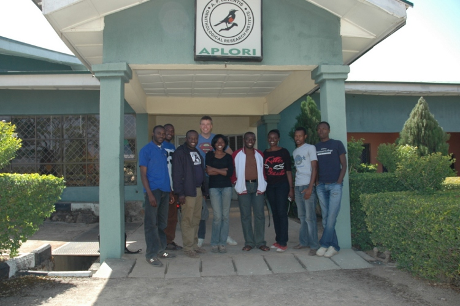
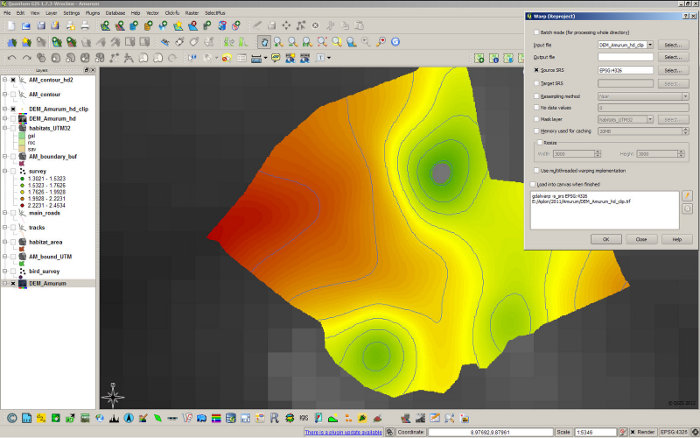
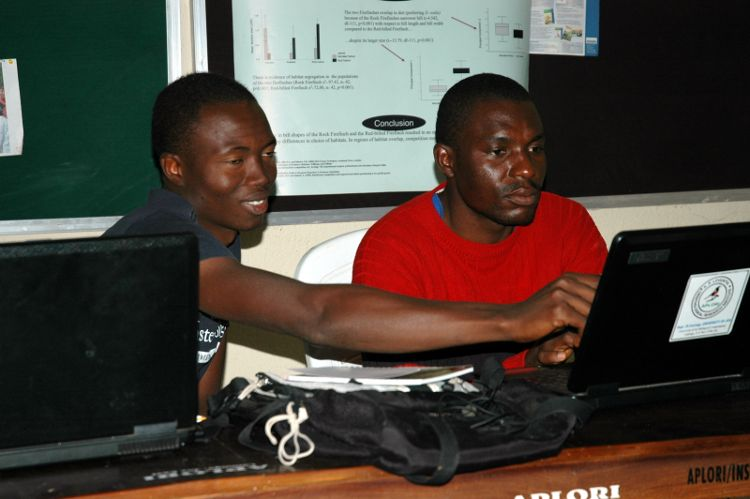
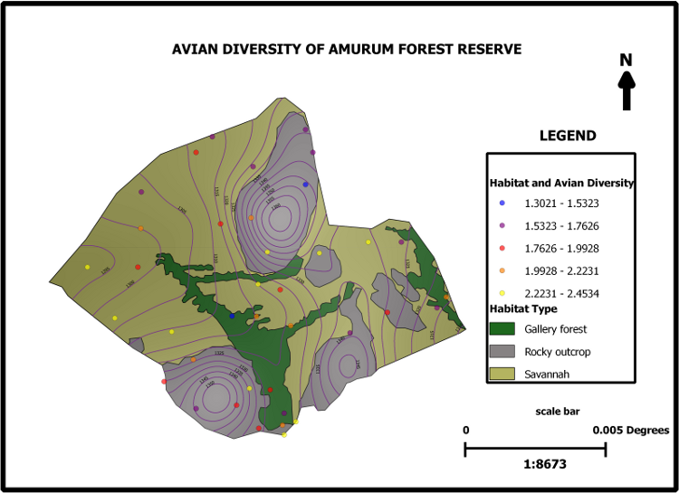

=======================================================================
Amurum forest reserve habitat and avifauna mapping with QGIS in Nigeria
=======================================================================

Amurum forest reserve is located near the city of Jos, Plateau state, Nigeria. It was established in conjunction with the initiation of the A.P. Leventis Ornithological Research Institute (APLORI) for the purpose of natural conservation, education and research. APLORI is hosted by the Department of Zoology at the University of Jos. Yearly a group of approximately eight highly motivated students from all over Nigeria obtain training in conservation biology, statistics (with R) and as of 2011 GIS as well. During two weeks in December 2011 we studied basic GIS concepts and applied those with QGIS for various conservation purposes. In this article we describe the way in which we used QGIS to map the habitats and its determinants of Amurum reserve and how the basic habitat maps were used to obtain strata for the purpose of efficiently determining the spatial distribution of the avifauna including the biodiversity.

   Training Group

Mapping elevation, hill shade, slope and habitats
=================================================

1) Mapping elevation and groundtruthing: We downloaded (free) elevation data originating from the NASA Shuttle Radar Topographic Mission (SRTM) for the area in which Amurum is located. (Information about the global elevation data set can be found here: http://www.cgiar-csi.org/data/elevation/item/45-srtm-90m-digital-elevation-database-v41). 

2) The GdalTools were used to merge original data sets and to clip a smaller area containing the reserve so that the raster data sets remained relatively small. By means of GPS we collected elevations at various locations in the reserve. 

3) Overall, the elevations of the SRTM data set corresponded well to the gps-collected elevations. Terrain models in GdalTools were used to calculate hills hades and slopes for the area. These variables are important from an ecological point of view because they are strongly associated with the type of habitat.

   QGIS screenshot

4) Since we intended to develop a good-looking map, we interpolated the original (clipped) elevation map to obtain a higher resolution map. We used the warp tool in GdalTools. By means of the contour tool we obtained smooth contour lines.

5) Coordinates of the boundary of the reserve were obtained by walking along the boundaries of the reserve with a GPS. The waypoints and tracks stored in the GPS were smoothly imported using the GPS Tools. The imported waypoints and tracks were used to construct a polygon shapefile. The tracks inside the reserve were mapped in a similar fashion.

6) We were able to quickly and precisely construct a habitat map of Amurum using a Google satellite image which we got into the workspace with the Openlayers plugin. The reserve has three types of distinct habitat: Savannah, Gallery forest and Rocky outcrop. On the basis of the satellite image we used the editor to draw polygons demarcating the three habitats. Setting the snapping options correctly allowed the construction of non-overlapping polygons.

Mapping bird distributions and diversity
========================================

The habitat maps were used to generate random locations. The area of the various types of habitat were used to generate a number of locations proportional to the surface of each habitat type (stratification).

   Training Group

The random points in fTools were used for this purpose. All the locations were visited during two mornings by four groups of students (2 per group) giving a total of 38 random locations dispersed throughout the reserve. The observation data were entered in a spreadsheet and analyzed using R. In addition, the Shannon-Wiener diversity index was calculated using R. After merging the location file with the resulting observation data it was exported as a csv file which was loaded into QGIS using the “Add delimited text layer” tool. On the basis of the above mentioned layers a map was constructed presenting some of the most important landscape features and avian diversity of the Amurum reserve.

Conclusion
==========

Overall, the course was a great success. We - a group of students with no previous GIS experience - enjoyed working with QGIS a lot. Within just two weeks time we were able to develop an extremely useful map of the reserve. Amongst others, the extents of the various habitats were determined which allows for stratification and thus for better estimates of abundances of various kinds of organisms. Basically we are now able to do better ecological research using QGIS as an open source platform.

   QGIS map: Diversity of Amurum Forest Reserve

Authors
=======
 
Abengowe Elmond Chiadikaobi, Adeyanju Temidayo Esther, Akiemen Nerioya, Albert Malangale Tauje, Azi Abok Joel, Echude Daniel, Eelke Folmer, Nwaogu Chima Josiah, Onoja Joseph Daniel, Yadok Biplang Godwill