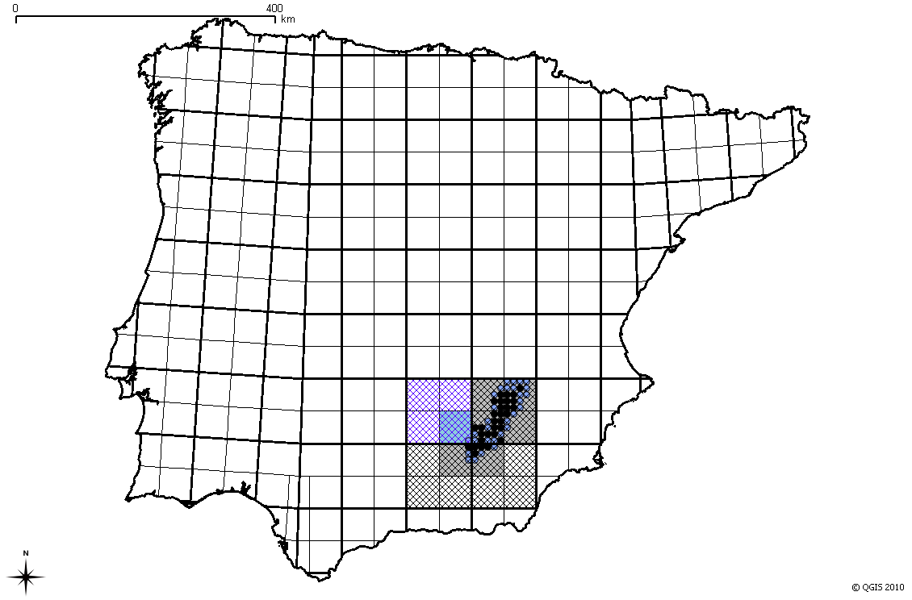
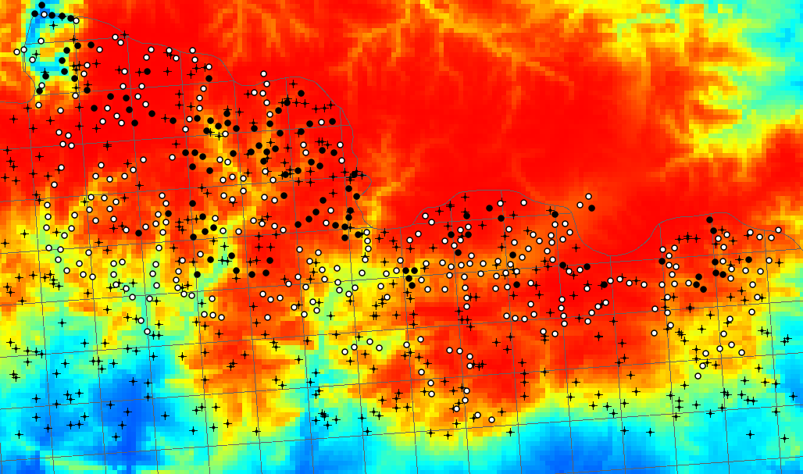
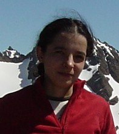

==========================================================================
Quantum GIS and GRASS in Biogeographical Research in the Iberian Peninsula
==========================================================================

I started applying GIS to my work in biogeography about 10 years ago. Through my graduate internship, PhD work and two other research jobs, I used the proprietary software packages that were available and used at my workplaces – mainly CartaLinx, Idrisi, ArcView and ArcGIS. But I found it rather annoying that we were constantly dealing with license renewal issues, and that I could not use the software away from the workplace unless I acquired my own license.

   Distribution of Spanish algyroides (Algyroides marchi) at three spatial scales and from two different data sources.

It crossed my mind on several occasions that switching to free software would spare me those problems. However, there was prejudice against the analytical capabilities of free software, and even after I heard about the potential of GRASS, I was still reluctant because I thought it would be too difficult to learn. I was also afraid it would be cumbersome to migrate all the maps and analyses that I had done so far. At the beginning of my post-doc in 2008, I finally gave it an opportunity and took a training course on Quantum GIS and GRASS. It was probably the best decision of my professional life! I found that QGIS provided a very intuitive interface for GRASS, hat they complemented each other perfectly, and they provided all the analytical capabilities I needed.
I started using both programs immediately after the course. Not only did I begin all my new GIS work with QGIS/GRASS [e.g. 1,2], but I also did follow-up analyses on previous works that I had done with commercial software. For example, I had built models of otter [3] and desman [4] distribution in the Iberian Peninsula. After switching to QGIS-GRASS, I analysed how those models behaved when downscaled to a finer resolution [5]. Another previous work on biogeographic relationships between Iberian lynx and rabbit [6] had a follow-up after I switched to QGIS-GRASS [7]. Not only did I not have any problems with the migration of the data and previous results: I also found it much easier to do the things I wanted to do with the new software, and was able to do extra analyses which I could not have done with the programs I used before.

   Environmental suitability for the Pyrenean desman (Galemys pyrenaicus) together with presence, absence, and random points in north Catalonia (Spain).

Conclusion
==========

All in all, switching to Quantum GIS/GRASS brought me nothing but advantages. I can now work freely at work, at home and on my laptop on the move, without having to worry about software licenses or moving to new institutions. Open-source software covers all my research needs and gives me the freedom I longed for.

Author
======

   A. Márcia Barbosa

This article was contributed in July 2010 by A. Márcia Barbosa. She is a post-doctoral researcher at Imperial College London (UK) and the University of Évora (Portugal).

References
==========

* [1] Barbosa A.M., Fontaneto D., Marini L. & Pautasso M. (2010) Is the human population a large-scale indicator of the species richness of ground beetles? Animal Conservation, early view. doi: 10.1111/j.1469-1795.2010.00363.x.
* [2] Fontaneto D., Barbosa A.M., Pautasso M. & Segers H. (submitted) The 'rotiferologist' effect and the drivers of species richness in rotifers.
* [3] Barbosa, A.M., R. Real, J. Olivero & J.M. Vargas, 2003. Otter (Lutra lutra) distribution modeling at two resolution scales suited to conservation planning in the Iberian Peninsula. Biological Conservation, 114:377-387.
* [4] Barbosa A.M., Real R. & Vargas J.M. (2009) Transferability of environmental favourability models in geographic space: the case of the Iberian desman (Galemys pyrenaicus) in Portugal and Spain. Ecological Modelling 220: 747-754. doi: 10.1016/j.ecolmodel.2008.12.004
* [5] Barbosa A.M., Real R. & Vargas J.M. (2010) Use of coarse-resolution models of species' distributions to guide local conservation inferences. Conservation Biology, early vew. doi: 10.1111/j.1523-1739.2010.01517.x
* [6] Real R., A. M. Barbosa, A. Rodríguez, F. J. García, J. M. Vargas, L. J. Palomo & M. Delibes, 2008. Conservation biogeography of ecologically-interacting species: the case of the Iberian lynx and the European rabbit. Diversity and Distributions, 15: 390–400. doi: 10.1111/j.1472-4642.2008.00546.x.
* [7] Barbosa, A.M. & Real, R. (in press) Favourable areas for expansion and reintroduction of Iberian lynx accounting for distribution trends and genetic diversity of the European rabbit. Wildlife Biology in Practice."