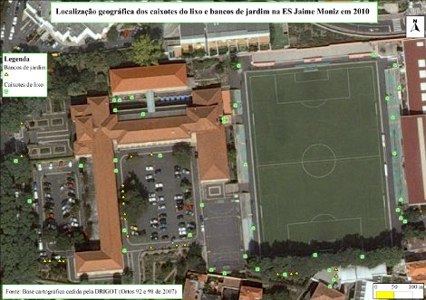
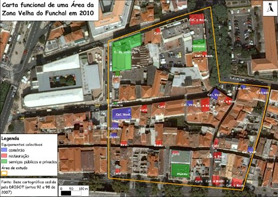
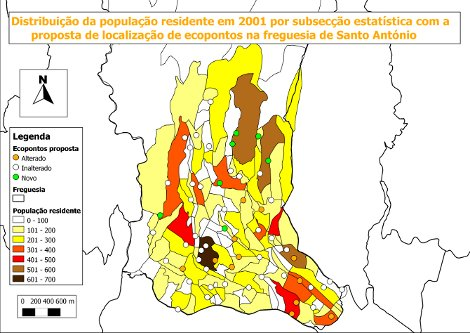

=============================================================
Using a free GIS at Jaime Moniz Secondary School: Quantum GIS
=============================================================

There will be democratic teaching in our schools or education communities when we generalize the use of Open Source software. This demands not only a change in people's way of thinking (sometimes molded by advertising), but also a sustainable management of expenses and, indirectly, fighting against software piracy. These advantages which are inherent to the philosophy of the Open Source software will be the model to follow if we want a quality education without boundaries or dependencies of any kind. From this perspective, class 35 of the 12th grade belonging to the technological course of territory and environment at Jaime Moniz Secondary School, uses QGIS to develop activities proposed in Geographical Information Systems, Applied Information Systems and during their training period. Within the range of options of free GIS, there were three underlying reasons for the choice of Open Source selection: the user friendly and intuitive approach, supported by online information provided by forums; the several software plug-ins and the quality of the product in its final stage. (One should bear in mind that these academic works were done by students who belong to a very young age group.)

The Project - Expectation
=========================

Expectation was the most dominating feeling in the firth lessons! The group of students had only a theoretical and somewhat vague knowledge about the issue of GIS. It was, therefore, necessary to link practical activities to that theoretical knowledge - at first, through the gathering of geographical information by using a support map, within the school's perimeter, and later, by using a GPS, concerning the area surrounding the school. In figures 1 and 2 it is possible to view some of the activities developed in class.

   Distribution of dustbins (green) and garden benches (yellow) at Jaime Moniz Secondary School

At present, some students are still using the QGIS to make different work plans during their training period. In figure 3, a student's work stands out: it is related to the distribution regarding the number of the inhabitants of Santo António, including a placement proposal for recycle containers, in a parish of Funchal.

   Functional map of an area in the old part of the town of Funchal, surrounding Jaime Moniz Secondary School

Decision for QGIS
=================

Number of the inhabitants (example) Generally speaking, QGIS allured the students: “to accomplish basic functions of GIS through exercise associations of graphic and non-graphic elements”; “to upload alphanumeric data”; “use functions of spacial analysis”; “to make thematic maps”; “to make a Digital Elevation Model” and, last but not least, “to recognize the relevance of a free GIS for the analysis of geographical  information, as well for the sustainable management of the territory”. These theoretical and practical purposes are achieved together along with other goals, extremely important in the education context, such as: “creating a diversified educational experience”; “being in contact with local reality” and “developing a constructive, positive and critical mind”.

From the class room to the education community
==============================================

The idea of creating a website: http://www.sig-na-jaime-moniz.webnode.pt implied two main purposes: “spreading the word about project works done by the students” and, simultaneously, “show the importance of Open Source QGIS for the accomplishment of these school works”. At present, the website is a motivation source for the follow up of the whole
teaching process.

   Placement proposal for recycle containers in the parish of Santo António

Conclusion
==========

In a flashback analysis of the whole process, I feel that the idea of using QGIS, as a tool, to accomplish some teaching purposes, was an excellent choice. At first, its use involved a lot of expectation. I had never used GIS before and, therefore, I was learning and teaching at the same time. The fact that the GIS turned out to be extremely user friendly together, with the information available online, was a blessing for me. Moreover, the school did not have to pay for another software license nor it was dependent on license renewals, which substantially improved the teaching quality, without any extra expenses. At present, students use QGIS almost on their own to accomplish their different work plans. I hope the final result shows the amount of effort involved in the whole learning process.

Author
======

   Fátima Vale

This article was elaborated in March 2011 by Fátima Vale with the support of Luís Antunes
(supervisor of the students in the DRIGOT). In that moment, she is teacher in the Jaime Moniz Secondary School and supervisor teacher during the training period of students in the different Institutions.

References
==========

* http://sitio.dgidc.min-edu.pt
* http://www.sres.pt/?page=drgc_loc_atend&separador=6&buttons=1
* http://www.sig-na-jaime-moniz.webnode.pt