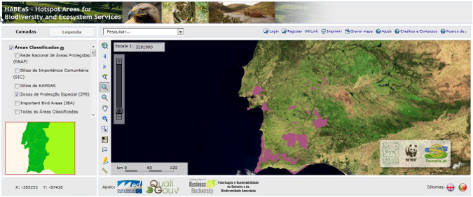
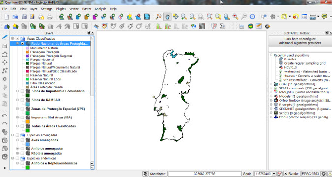
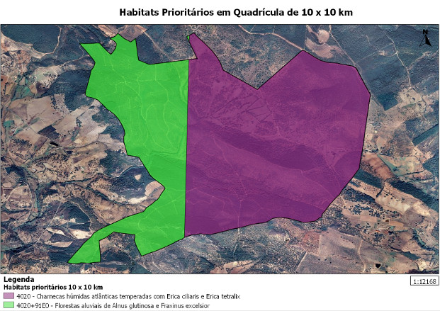
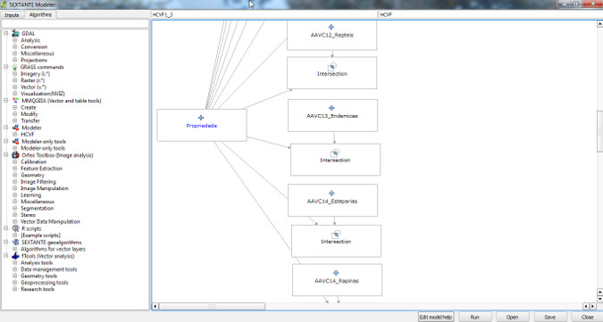
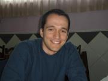

=======================================================================================
Using Quantum GIS to Map Hotspot Areas for Biodiversity and Ecosystem Services (HABEaS)
=======================================================================================

HABEaS - Hotspot Areas for Biodiversity and Ecosystem Services is an online geographic information system (WebGIS) that was created by the `Centre for Applied Ecology <http://www.isa.utl.pt/ceabn/content/2/123/homepage>`_ (`Instituto Superior de Agronomia <http://www.isa.utl.pt/home/>`_, Technical University of Lisbon), Worldwide Fund for Nature (WWF) and Faunalia.
The main goal of this platform is to provide free access to a wide variety of data on biodiversity and ecosystem services for the Mediterranean Basin that was scattered across a number of public and private entities. Presently HABEaS WebGIS covers the south of Portugal, but by the end of 2012/early 2013 it will be expanded to the north of Portugal and also to the Tuzla Canton in Bosnia & Herzegovina. In the long run we want to expand this tool to the entire Mediterranean Basin.

Since the main goal of this tool is to promote free and easy access to information on biodiversity and ecosystem services we decided to use only free and open source software, that any person or entity can use regardless of their location or financial constraints. The website where HABEaS WebGIS is hosted on a server that runs Debian Linux and was developed with Drupal CMS. PostgreSQL/PostGIS was used to store the data and Quantum GIS was used to process and analyze the GIS that we obtained from several entities. We used both Quantum GIS's native tools but also GRASS GIS and SAGA GIS tools through the GRASS plugin and SEXTANTE Toolbox.

The geographic information contained in HABEaS has also been used by WWF to provide support for the identification of High Conservation Value Forests (HCVF) in the south of Portugal, which is a mandatory step for landowners that want their forests to receive Forest Stewardship Council (FSC) Certification.

To determine which conservation values occure in each property we used SEXTANTE Modeller to create a script that intersects all HABEaS layers with the boundaries of the property. Using the same tool we were also able to create a script that automatically calculates the amount of carbon that is currently stored in each property.

Conclusions
===========

Quantum GIS is easy to use and has very powerful geoprocessing capabilities. The integration of GRASS GIS and SAGA GIS tools through SEXTANTE Toolbox allowed us to perform a number of complex spatial analyzes and to pipeline them using SEXTANTE Modeler. It was also very easy to produce high quality maps with the new Print Composer and to export them in SVG format for further editing with Inkscape which is a powerful open source vector graphics editor.
In general, our experience with Quantum GIS has been very positive, the software runs smoothly and the community is very active and supportive. Reported bugs are usually resolved shortly after being reported by users and Quantum GIS developers are always willing to listen to “end user's” needs and suggestions.

Author
======

   Filipe Dias

Filipe Dias is a PhD student at the Center for Applied Ecology (Instituto Superior de Agronomia, Techinical University of Lisbon) and a consultant of the Mediterranean Programme of World Wide Fund for Nature (WWF).