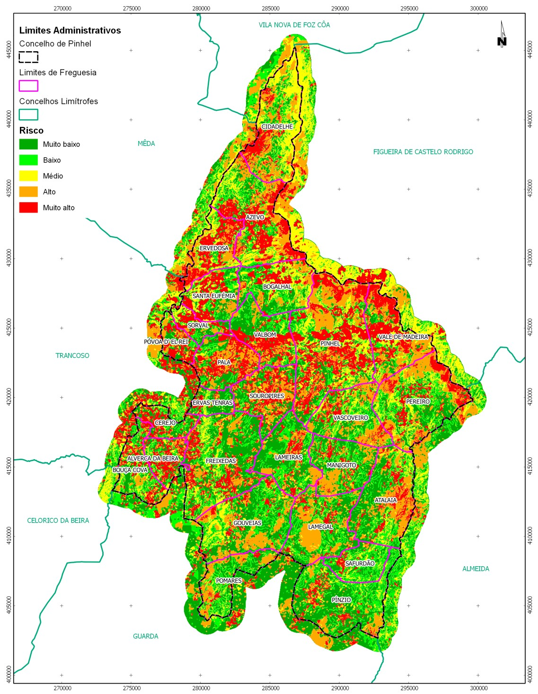
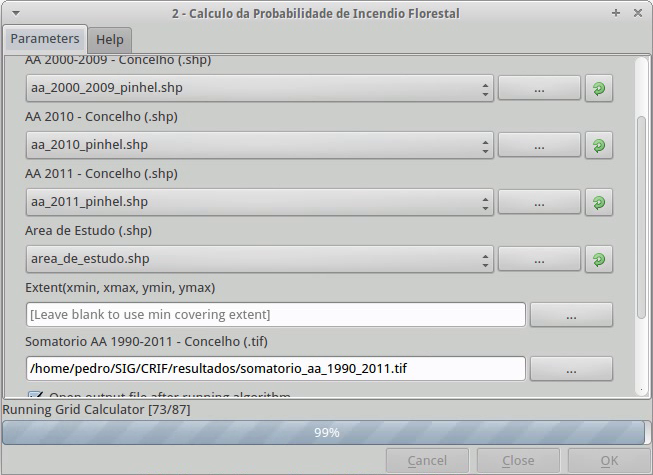
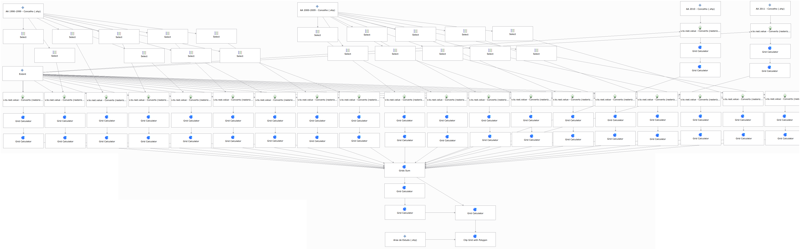
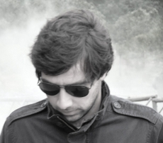

====================================================
Quantum GIS and Forest Fire Risk Mapping in Portugal
====================================================

Portugal has been affected by large wildfires causing huge losses, not only environmental, but also economic and social losses. To face this risk, the portuguese government, through the National Forest Authority (AFN), decided, a few years ago, to create technical offices allocated to local governments which, among other skills, must prepare Municipal Plans for Forest Fire Protection and Operational Response.
 
In order to support the elaboration of these documents, the AFN provided technical guides with a methodology for calculating and mapping the Forest Fire Hazard and Risk. Moreover, tutorials have been offered to follow this methodology, using Proprietary Software. However, the acquisition and licensing costs of that software are unaffordable for most of the smaller local administrations and so, it was decided to create and make available a guide with a methodology for developing Hazard and Risk cartography using only Free and Open Source Software [http://goo.gl/TSv2E].
 
It was proposed to use the following set of software: QGIS, GRASS GIS, gvSIG and GDAL/OGR libraries. That guide describes all the geoprocessing tasks necessary for the elaboration of the plans for Forest Fire Protection and Operational Response, according to the AFN methodology. A large part of the tasks were developed with QGIS, and spatial analysis in raster model was developed with GRASS. gvSIG was used for network analysis, with its Network Analysis extension, and GDAL/OGR libraries were used for transformations between coordinate reference systems.
 
After an extensive suite of tests to the methodology, and three years of real application in the preparation of the Operational Plan for the municipality of Pinhel, it can be said that the proposed alternatives allow to replace, with many advantages, Proprietary Software that is usually used to carry out this task. The validation of the results shows that, despite the relative simplicity of the conceptual model, its predictive ability is quite good, and that the model implementation in Open Source Software does not interfere negatively with the results, quite the opposite.

 .. figure:: ./images/portugal_pinhel1.jpg
   :alt: Forest Fire Hazard and Risk Maps of Pinhel
   :scale: 40%
   :align: right

   Forest Fire Hazard and Risk Maps of Pinhel, implemented with Open Source Software.
 
In a second phase, it was tried to speed up this process, using models to establish a workflow that perform a wide set of tasks, almost without human intervention. This second stage consisted essentially in the automation of the entire procedure described in practical guide which resulted from the first phase. Such automation could mean a reduction of several hours of intense work on the part of the technician who intends to produce annually Forest Defense Plans, for just a few minutes, in which the human intervention boils down to the selection of input data and the indication of the place where we intend to keep the output data.

   Interface of the Sextante Model to calculate the Probability of the Forest Fire Hazard.
 
In furtherance of this second phase, we used the Python version of Sextante software, that works integrated into QGIS and adds a broad set of independent applications (GRASS GIS, SAGA GIS, OTB, R, GDAL/OGR, Pymorph, LASTools, Python scrips, etc..) in a single interface, providing a huge geoprocessing toolbox to QGIS users. Besides the integration of these applications in QGIS, Sextante has a tool for creating models, taking advantage of the modules offered by any of those softwares which aggregates. So, we've created a model to automate the process of producing Forest Fire Hazard and Risk maps, using GRASS, SAGA, fTools and MMQGIS tools.

   Part of the model developed for automation of the production of cartography for Forest Fire Hazard and Risk.
 
The results obtained so far are very promising, as already can be automatically achieved the creation of the Hazard and Risk Maps [2]. Taking into account that the Python version of Sextante is still very recent and is in heavy construction, there are some problems that must be corrected so that the models may be completed, which certainly will happen very soon, given the momentum that Sextante project presents. As future work, we intend to apply, also automatically, the symbology to the results as well as provide the final layouts in QGIS Composer, ready for export and/or print. Upon completion of the second phase and the realization of a sufficient set of tests that can validate the results obtained, it is our intention to provide the model free and openly.
 
Conclusions
===========

The alternatives studied proved to be of enormous quality, allowing all operations recommended in the National Forest Authority technical guides, in many ways, more efficiently than with Proprietary Software. In terms of ease of use, it was observed that this type of software is not, in any way, more complex than the proprietary software, requiring only more technical knowledge of the models and algorithms implemented which, however, allow a higher degree of freedom, making possible to explore and fine tune the models to each particular situation. The process of producing Forest Fire Hazard and Risk cartography using, exclusively, Open Source Software is fully consolidated, after several years of testing and application in the municipality of Pinhel.
 
The fact that Open Source Software is based on standards and support most of the open data formats, allows the complete interoperability between software, allowing the user to opt for the most suitable in each moment. Despite our proposal point to a specific set of software, nothing prevents to be replaced by any of the existing alternatives in the wide range of proposals for Free and Open Source Software for Geospatial. However, QGIS increasingly presents itself as the most complete, stable and easy to use FOSS4G solution, and whose project is more dynamic, with rapid correction of bugs and with almost daily implementation of new plugins that adds specific functionalities to the most diverse areas of activities.
 
Author
======

   
   Pedro Venâncio

Pedro Venâncio B.Sc. in Geology, Postgraduate in Free Software and M.Sc. in Geographic Information Systems. He was a researcher at the Centre for Geophysics of the University of Coimbra, at the National Laboratory for Civil Engineering and is currently responsible for the service of Cartography and Geographic Information Systems at the Municipality of Pinhel.