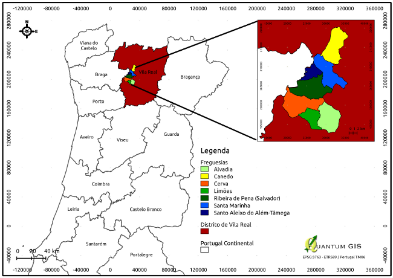
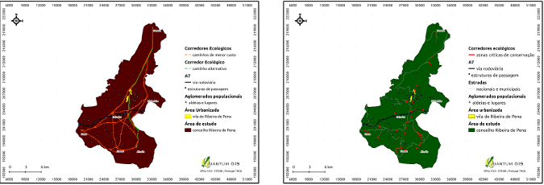
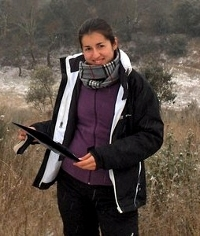

==============================================================================
QGIS and GRASS for modelling ecological corridors for wolves in North Portugal
==============================================================================

The Iberian wolf is a sub-species of the gray wolf that exists only in north of Portugal and Spain, with small isolated groups in the south of Douro river. During the last century, it suffered a high regression, being a “vulnerable” species in Spain and “endangered” in Portugal. Nowadays, there are only around 300 wolves in Portugal,  due to the high persecution, destruction and fragmentation of the habitat.

   
   Study area in Portugal

Ribeira de Pena is a municipality in the Vila Real district in the north of Portugal. It is a rural municipality, characterized by agriculture, grazing livestock, forest, mountains, valleys and diverse fauna, along with low human density, that provides shelter and food for wolves. Located in a zone of transition between the harsh and mountainous Trás-os-Montes and the verdant Minho, Ribeira de Pena is one of the municipalities that can work like an ecological corridor between areas with higher wolf concentration in the north with lower concentration in the south.

I started using GIS software during my biology course, and more often during my master thesis. At that time I used mainly proprietary software. After I finished my master degree, I lost access to the proprietary software.

Meanwhile, I entered in the new world of Linux. After that I was contacted to help some researchers to model ecological corridors for wolves in Ribeira de Pena, using GIS, since they never worked with this kind of software. Because I was already using Linux instead of windows, my first problem was which software to use. Then I heard about QGIS and decided to give it a try, although it seemed very simplistic and incomplete, when compared to what I already knew. I quickly realized how mistaken I was, and got really enthusiastic with the analytical capabilities QGIS provided, specially with GRASS integration.

To model the ecological corridors, we used the QGIS along with the GRASS plugin. 
We used several geographic information along with presence data of the species to model the ecological corridors. Here are some of the functions of both QGIS and GRASS used in this case, just to name a few:
* plugin Interpolation in QGIS: to create a Digital Elevation Model
* r.watershed in GRASS: to create water streams from DEM
* r.grow.distance in GRASS: generates a raster map layer of distance to features in input layer
* r.reclass in GRASS: to reclassify map layers
* r.slope.aspect.slope in GRASS: to calculate the slope from the DEM
* r.mapcalculator in GRASS: to calculate some simple map algebra
* r.cost.coord in GRASS: creates a raster map showing the cumulative cost of moving between different geographic locations on an input raster map whose cell category values represent cost
* r.drain in GRASS: Traces a flow through an elevation model on a raster map – the one used to create the corridors
With this work we obtained a map with the potential ecological corridors for wolf in Ribeira de Pena municipality. These are areas to be considered by the city council technicians when planning conservation measures for the species. These corridors are of extreme importance because they can connect the fragile wolf packs in Vila Real in the south with those in the north, which are continuous with those from Peneda-Gerês and Spain far more stable. It is from particular importance those corridors that cross human settlements, like small villages, cities and roads. These areas must be considered critical for wolf conservation, and applied measures to reduce human impact in this species.

   Ecological corridors and critical conservation areas for wolves in northern Portugal.

Conclusion
==========

Both QGIS and plugin GRASS are very intuitive with user-friendly interface, with all essential functions to perform most analysis. For what I could see, QGIS and GRASS perform equally as well as the proprietary programs I was most familiar with from college days, with the big advantage of free open-source software, usable in every computer or notebook without licenses, constant upgrades and the ultimate advantage to contribute to it's improvement and/or tip the developers about some essential function.

Changing to Linux and then to QGIS and GRASS was one of my best calls, and although there can be some missing issues, easily resolved in the future with the developers, I don't regret my decision and advise everyone to use them.

Author
======

This article was contributed in July 2012 by Monica Almeida. She is conservation biologist working in an non-governmental organization in the preservation of wolf in Portugal.