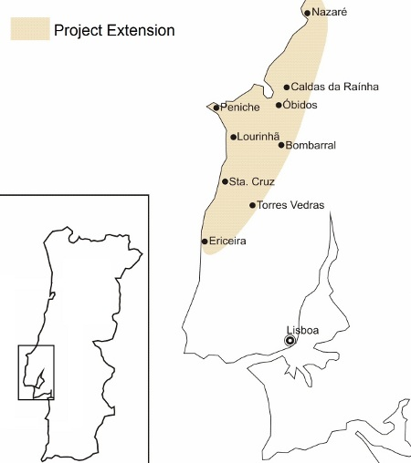
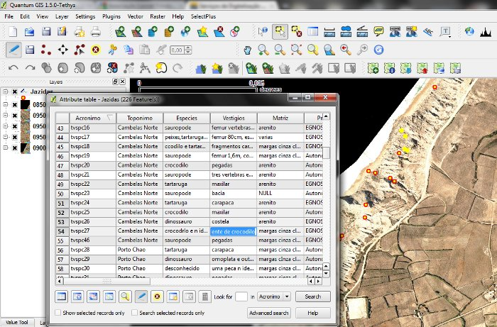
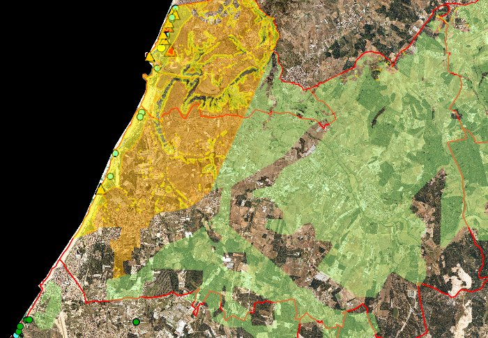

====================================================================
QGIS and GRASS applied to paleontological survey in Western Portugal
====================================================================

 
The Associação Leonel Trindade – Sociedade de História Natural (ALT-SHN) is a non profit institution headquarted in Torres Vedras, Portugal, specialized in paleontology. The institution manages a large fossil collection, mainly from Upper Jurassic. One of the key issues in paleontological management is to assess spatial context of the sites from where the fossils are retrieved – hundreds of sites representing thousands of different specimens.

The Project
===========

Back in 2008, we came up with the idea of exploring GIS technologies to support the investigation and get a more holistic perspective on the heritage we were dealing. This idea boosted SIGAP Project (GIS applied to paleontology) [2]. The project, supported by public and private entities – mainly the Municipalty, Digiterra.hu and the Army's Geographic Institute (IGeoE), aimed three goals:

* Field Survey with Differencial GPS to gather the coordinates of the sites;
* Build a Risk Model to identify hazards towards paleontological heritage and thus prevent them through regular field surveys;
* Build a Geographic Database to handle all the information and start the collection inventory.
 
Software we used
================

QGIS was the mainframe of all the project. Data was dumped directly to QGIS, and then edited and manipulated in order to achieve the desired outputs. The GRASS interface provided by QGIS allowed us to conduct complex spatial analyis on rasters in order to obtain the risk model we needed to plan our field work and future prospection.
Furthermore it allowed us to import PostGIS layers and visualize them on QGIS.

   Vector point data editing and visualization
 
The choice for QGIS was also encouraged by the multi platform support. The institution has three distinct facilities, and each of those facilities has different systems – We have Mac, Windows PC and Linux PC, therefore it's of extreme importance that we have the freedom to install the software on any machine we want so we don't get stuck to a particular computer.
 

   Paleontological Risk Map

Conclusion
==========

The overall experience with QGIS can only be rated has being very good and recommendable. From our point of view, the main advantage of QGIS is that it's not just a GIS software – it's a productivity suite for spatial data. It allowed us to take advantage of other powerful tools within a single work environment. From QGIS you can work with GRASS, with PostGIS, with GPS data, with webservices and with tens of useful plug-ins developed by users worldwide. The user friendly interface is also a big advantage, especially if you have to train first time users has we've done. The easyness of the interface makes production of maps an everyday task and brought people closer to spatial approaches [3].

Author
======

.. figure:: ./images/portugal_torresaut.png
   :alt: Nathan Woodrow
   :height: 200
   :align: left
   
   André Mano

This article was contributed in November 2010 by André Mano. He is responsible for the Geopraphic Department of Associação Leonel Trindade – Sociedade de História Natural. His area of interest is focused on geotechnology applications to the fields of paleontology, archeology and cultural heritage.

References
==========

* [1] www.alt-shn.org (portuguese only)
* [2] MANO, André. (2009) – Sistema de Informação Geográfica Aplicado à Paleontologia. Paleolusitana: Revista de Paleontologia e Paleoecologia, Torres Vedras: Alt-Sociedade de História Natural. ISSN 1647-2756, n.º 1, p. 245-250.
* [3] Mano, André. (2010) – Projecto SIGAP, Trabalho de Projecto apresentado como requisito parcial para a obtenção do grau de Mestre em Ciência e Sistemas de Informação Geográfica. ISEGI – UNL, Lisboa, 2010