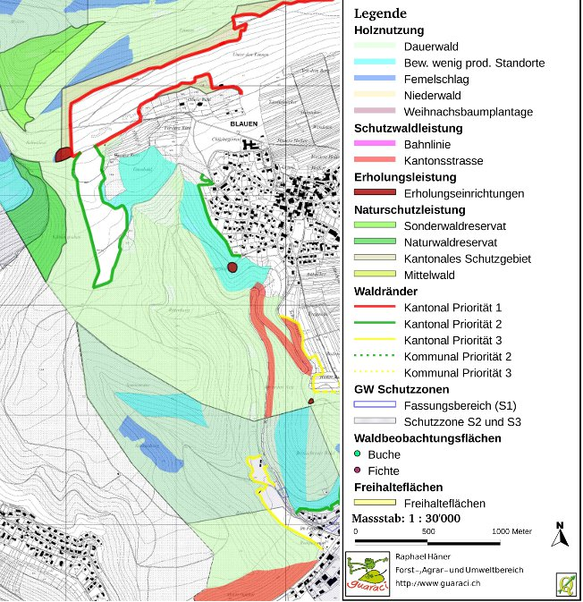

======================================================
QGIS - an interesting instrument for forestry planning 
======================================================

concepts at local and regional level

Almost 35% of Switzerland's surface is covered by forests. Changing demands upon the forest and the poor financial situation of forest enterprises in Switzerland led to the development of a new forestry planning concept about fifteen years ago. This concept introduced a clear distinction between planning at the level of the authorities and planning at the level of the owners1. As a new forestry planning office, guaraci works primarily in the region of Basel (Switzerland) on both mentioned planning levels. This case study discusses the use of QGIS at the forest owner level. On this level, a simple, dynamic and compatible geographic information system is required for the establishment of a forest management plan. This plan covers about 1000 ha of forests, will be valid for about 20 years and is implemented by the local forest manager. The area is situated in the region of Basel (see google maps).

How QGIS was used
=================

Within the whole planning process QGIS was used for the following four tasks:

* Import of existing data. The data includes geo-referenced background maps (\*.tif) along with polygon, line and point shape files. For the forest manager, the visualization of existing thematic data (for example ground- and drinking water resources, nature protection zones) are important for his daily work.
* Digitizing. The forestry measurements planned by the forest manager had been digitized. The QGIS digitizing tools with the advanced snapping options are very useful and user friendly. The „delimited text“ plugin enabled the import of additional data tables.
* Analysis. The areas of the different measurement categories had been calculated. Starting from certain line features such as train tracks or roads, corresponding protection forests were determined with the help of a buffer.
* Print and export. The print composer supported the map layout creation. The map was exported as PDF and image files.

   Extract of the forestry measurements map

Conclusion
==========

QGIS is an interesting tool for small planning offices, such as guaraci, as well as for the forest managers and owners. It can be used in a professional context and the presented output result was appreciated by all parties involved. For the mentioned tasks the present QGIS version “1.4 Enceladus” offers all necessary GIS tools. The most important qualities of QGIS are the intuitive user interface and the compatibility with different file formats. It is an ideal tool for projects that are on one hand based on existing geographic data and on the other hand require the acquisition of new data. The user-manual is helpful and easy to understand. Both from the technical as well as the financial perspective QGIS is an interesting alternative to other GIS software.

Perspective
===========

The core tasks of a forestry planning concept can be worked out with the mentioned basic GIS tools. Guaraci will continue to use QGIS for forestry planning at the forest owner level. Based on the experiences with the presented project, QGIS can also be recommended for forestry concepts at the level of local authorities. Larger, and more complex projects with detailed analysis requirements could be handled by the combination of QGIS with the Postgis spatial database server. New logging zones as well as forest reservates and protection zones can be easily digitized. Hopefully, forest owners and managers will increasingly use the potential of QGIS also for their yearly planning as well as the documentation of their forest activities.

Author
======

   Raphael Häner

This article was contributed in June 2010 by Raphael Häner. He is  Dipl. Forst Ing. at ETH Zürich, Switzerland and founded his one-man company guaraci in 2009.