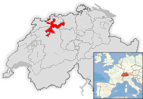
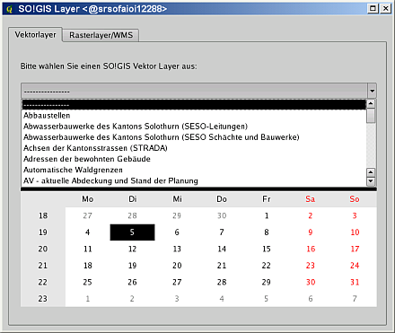
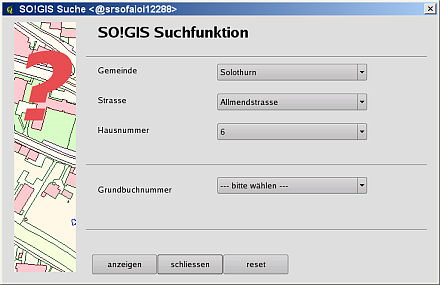

======================================
QGIS in the governmental FOSSGIS stack 
======================================

of the Canton of Solothurn in Switzerland

The Canton of Solothurn provides services and infrastructure to 250,000 Solothurn citizens. In the year 2001 the State Parliament decided to migrate from Windows to Linux. The motivations were to be independent from one particular vendor, to encourage free enterprise and reduce license costs. As a result SO!GIS department of the Canton of Solothurn started to deliver the GIS-requirements of more than 3500 employees with a FOSSGIS strategy.
The first step we took was the introduction of UMN MapServer and the creation of a SO!MAP client that offers an easy to use WebGIS client for all the 3500 employees. The second step was the migration of all our geospatial data from Shapefiles to the PostGIS spatial database engine. The introduction was very successful, but an easy to use desktop GIS was lacking.
After an evaluation of different Desktop GIS we decided to use QGIS in conjunction with GRASS, replacing ESRI ArcInfo and ArcView3 in the 2006.

The decision was driven by the following aspects:

* Due to our use of desktop GIS in a Linux Terminal Server environment, Java wasn't an option.
* OSGeo Project-Organisation
* GUI translated in German language
* Documentation written in German language
* An Active developer (Marco Hugentobler) near Solothurn in Switzerland.
* We could contract Marco Hugentobler to implement missing / lacking features like Digitizing and Mapcomposing.
* Application and Plugin developement with Python
* Growing user community
* Very active developer community
* Independence from a single operating system

Where do we use QGIS
====================

In contrast to the interactive maps served by UMN MapServer, the desktop GIS has to offer a flexible view at the geospatial data of Solothurn. QGIS Desktop GIS is in use by more than 50 users for their daily work. But many of them are not GIS experts. They want to visualize and/or capture geospatial data with an intuitive user interface.
One of the most important Desktop GIS issues is the question: "How do I get the information from the PostGIS geodata repository I need?". Since our end users are unfamiliar with data models and the underlying structures of our spatial database, offering the users a raw connection to the PostGIS DB was not an option. We have a metadata database that stores the descriptions of all production data called 'SO!DATA'.
SO!DATA contains a human readable inventory of the data models and the non-GIS-Expert user is able to use this database to discover the information they need.

   "SO!GIS Layer" plugin developed at the Canton of Solothurn

To remove the need for end users to interact directly with PostGIS connections and table selection dialogs, a plugin has been developed in python. The plugin is called "SO!GIS Layer" (see Figure 1). The plugin connects to the SO!GIS PostGIS repository, gets the information of all published geospatial data layers from SO!DATA and offers the user a GUI to find the data layers they need. With this infrastructure in place, our users are happy - they can prepare for geoprocessing, editing and map composing in an individual way.
 

   "SO!GIS Suche" plugin developed at the Canton of Solothurn

Another required QGIS plugin we created is called 'SO!GIS Suche'. This provides the possibility to search for locations like townships, addresses or cadastral parcels (see Figure 2). As a result the user is able to navigate very easily to an area of interest.
At the moment many other plugins are under development. These will support data manipulation, analysis or mapping for different projects. Our in-development plugins cover topics  such as nature reserves, soil conservation, cadastral data verification, crisis management, abandoned sites and so on.

Conclusion
==========

Today we can say that using QGIS was the right decision for us. QGIS offers most of the features requested by our users. The Canton of Solothurn subcontracts the creation of features that QGIS lacks to commercial support providers. With PyQgis and PyQt there are excellent options for easy in-house application development based on QGIS. One huge benefit is the unlimited number of installations. Everyone who needs to use QGIS can use it without any limitations. To push the development of QGIS the Canton of Solothurn has invested approximately $30,000 into QGIS every year since 2007. This is much more efficient and target-oriented than the payment of support into the black box of our former software provider. Apart from using FOSSGIS, the Canton of Solothurn also provides public geodata free of charge via the SO!ONLINE web portal.

Author
======

   Horst Düster

This article was contributed in May 2009 by Dr. Horst Düster. He is GIS coordinator at the Department of Geoinformation in the Canton of Solothurn, Switzerland.