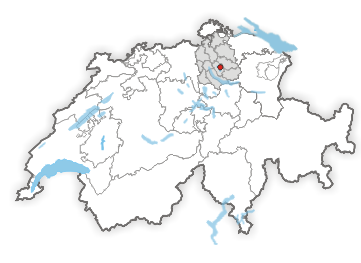
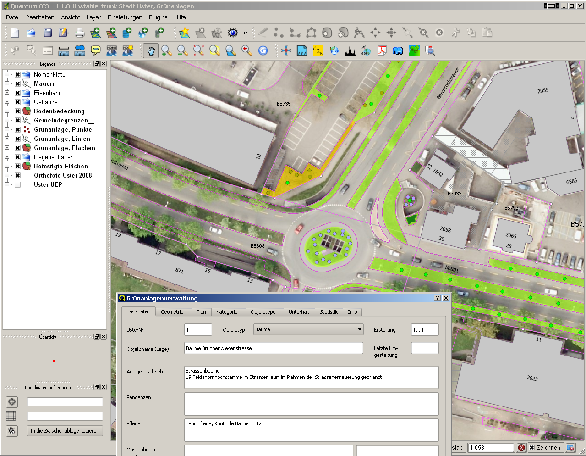
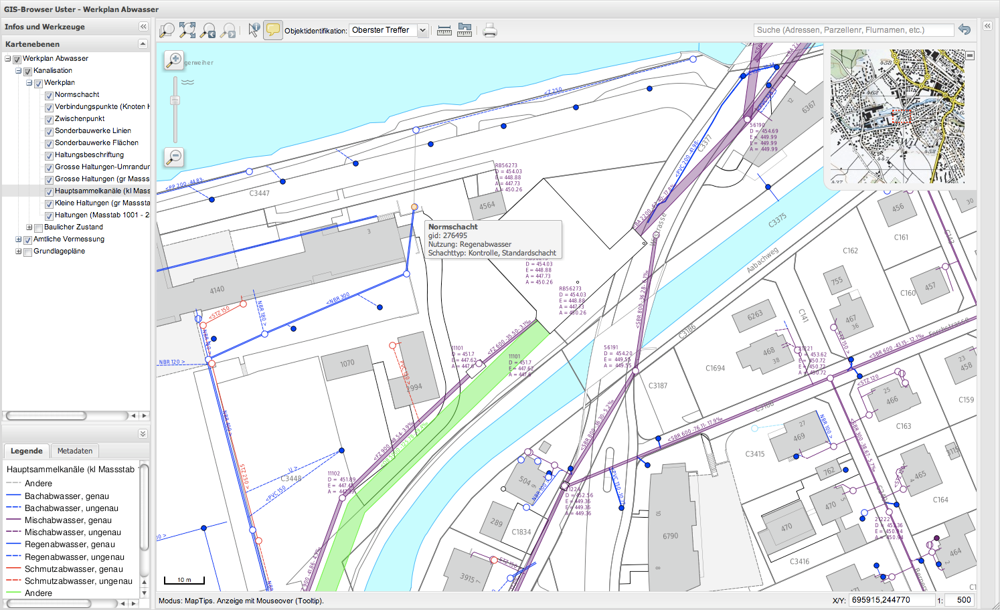

==================================================================
The use of QGIS in the Geodata Infrastructure of the City of Uster
==================================================================

The City of Uster has been using QGIS since 2007. Encouraged by the decision of the Kanton of Solothurn to use QGIS as a Desktop GIS replacement for ArcView, Uster decided to also give it a try. The city joined the effort for the further development of the QGIS application, by suggesting and testing new features and by financially supporting the development. In return Uster receives a rapidly evolving and platform independent Desktop GIS and WebGIS solution backed by a worldwide user and development community.

 
Postgis/PostgreSQL is used as a central geodata warehouse. Other databases and data sources are replicated into PostgreSQL at a regular interval, using tools such as OGR and FME. In the beginning QGIS was mainly used as a viewer. The first QGIS user was a farmer who had the task of supervising the declarations made by local farmers for receiving agricultural subsidies. Later, QGIS was also introduced as a data editor and map publishing platform, along with the improvements of the editing tools and the print composer. Together with other Swiss QGIS users (Solothurn, Thun and CDE (University of Berne)) we coordinate and sponsor the improvements of these tools, along with some improvements in data driven symbolization, automated labeling, attribute handling and forms.
 

The city administration also uses commercial GIS software: Autodesk Topobase, for the capturing and editing of cadastral and waste-water infrastructure data, and GE Smallworld for the management of gas, water and electricity networks. However, these are expert systems in use by specially trained staff. All other GIS projects and the viewing of all data is handled by QGIS.
 
In the second half of 2010, first tests with QGIS server were carried out. In 2011 we introduced a new WebGIS system based on the QGIS WMS server and GeoExt/OpenLayers as the web client. The main reasons for the decision to use QGIS server were the considerable time savings made possible by re-using the existing QGIS desktop project configurations, rather than having to manage parallel Web project configurations. Additional advantages are the rich set of symbolization and labeling options and the consistent map rendering between the Desktop GIS application and the Web-GIS. The QGIS webclient can be tested and used at http://gis.uster.ch/

 
Today, QGIS is used for the following GIS projects:

* viewing of waste-water data, integration of additional databases and direct access to canal videos and inspection protocols
* viewing and editing for monitoring and the environmental and urban planning of the waste water and hydrology systems (german: Genereller Entwässerungsplan)
* viewing of underground cadastral data (waste water, water, gas and electricity networks, later also telecommunication) (german: Leitungskataster)
* viewing of cadastral and survey data
* viewing and editing of the communal inventory of protected natural sites
* viewing and editing of urban and regional planning data
* viewing and editing of road infrastructure data
* viewing statistics generated directly from the database of current and past residents

Planning and visualization for energy planning (gas supply regions, heat use from waste water, near-surface geothermal energy, block heating stations, etc.)
Additional further projects are currently under development.
 

In 2007 it was not entirely clear at what pace QGIS would be further developed and how both community and commercial support would evolve. Today it can be stated that the speed of development and the improvements made by the QGIS community exceeded our expectations. Community and commercial support from the companies Sourcepole and Norbit is excellent. There is a direct communication with developers without being shielded away by a product management or sales team. The developers of these two companies are also lead developers of the QGIS project and have excellent knowledge of the code base.
 
Bugs are often fixed within hours or days after reporting and new developments are implemented in a short time frame. New features can be tested immediately after development and deployed to the users whenever the quality is good enough for the end user. There is no need to wait for official software releases. We enjoy the freedom of being able to influence the project and to install the software on as many computers we like without having to deal with licensing management. We are looking forward to future collaboration with the QGIS community and our commercial supporters for the advancement of the QGIS project.

Author
======

   
   Andreas Neumann

This article was contributed in April 2011 by Dr. Andreas Neumann. He is GIS coordinator at the City of Uster, Switzerland.