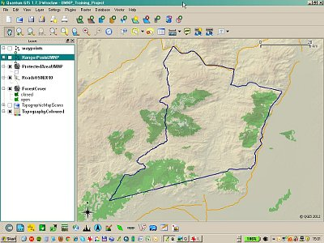
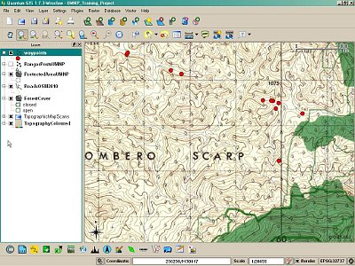

============================================
Using QGIS for wildlife training in Tanzania
============================================

Introduction
============

Working in southern Tanzania, the Udzungwa Elephant Project (UEP) is using Quantum GIS for its training in wildlife research and conservation. In February 2012, it held a two-day workshop for the Ecology and Protection (anti-poaching) staff of the Udzungwa Mountains National Park, along with members of the Udzungwa Ecological Monitoring Centre.

About the Training
==================

Trainees used their own laptops and were provided with the installer for QGIS 1.7.3 along with key data layers covering the National Park: protected area boundaries, scanned topographic maps, a DEM, roads, ranger posts, and habitat types.

   QGIS Udzungwa

By the end of the two days, everyone was able to add GPS download data, create and edit new layers, save map projects, design print composers, and save graphics files for inclusion in reports and presentations - this last feature is specially useful in using GIS to help in normal workflows. Even during the course, National Park staff were using the GIS to view the GPS locations of new-reported elephant carcass locations - the result of poaching - and to start planning responses.
QGIS offered us several attractions: not only is it completely free, but its open source nature makes it responsive to particular development needs; it runs well on older computers and has a relatively small installer; and in general we have found it user-friendly for newcomers to GIS.

The Udzungwa Elephant Project is based next to Tanzania's Udzungwa Mountains National Park, a range of evergreen forested mountains reaching over 2,500 metres. It studies the ecology of elephants in and around the mountains, with the aim of understanding how elephants move between different Tanzanian parks and reserves, and how such corridors might be maintained while reducing crop damage caused by elephants. More widely, elephants are a "flagship species" for the conservation of the incredible wildlife and landscapes of southern Tanzania.
 

   QGIS Udzungwa 2

Special thanks to the US Fish and Wildlife Service African Elephant Fund for supporting this training.
Links
http://www.facebook.com/pages/Udzungwa-Elephant-Project/157164174392263
http://udzungwa.wildlifedirect.org/2012/02/10/qgis-training-for-park-staff/
http://www.udzungwacentre.org/
 
Author
======

   Nick McWilliam

This article was contributed in March 2012 by Nick McWilliam. UK-based, he has been visiting Tanzania since 1996 to work with GIS in National parks and Game Reserves, with an emphasis on training, low-cost systems, and using GIS to help in applied research,  
management and conservation. He also volunteers with the NGO MapAction, providing GIS support to humanitarian organisations in emergencies, and previously worked with the British Antarctic Survey,  United Nations, Royal Geographical Society, and as a GIS Lecturer.