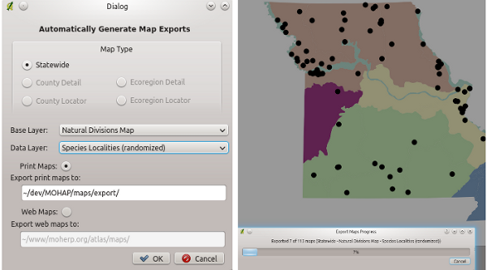
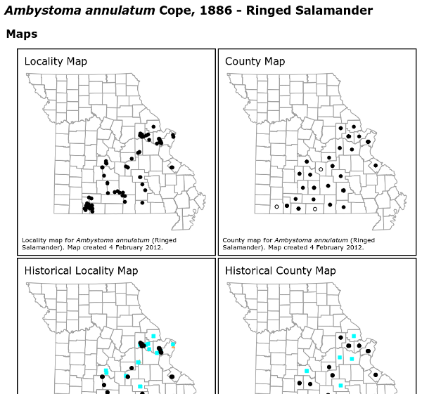
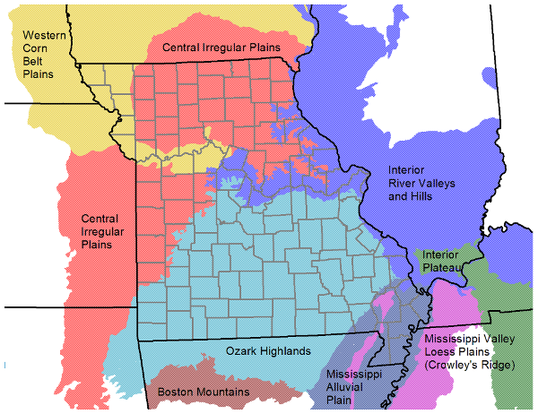

===============================================
Quantum GIS Maps Historic Herpetofaunal Records
===============================================

(in Missouri, USA)

The Missouri Herpetological Atlas Project (MOHAP) was initiated in 1997 as a result of the desire to obtain and easily update detailed distribution maps for Missouri (United States of America) amphibians and reptiles. A database was established to store all valid localities, including records published in historical literature sources and specimens vouchered from museums. From the database, a series of maps can be produced representing both locality records and "county records" for each species.

MOHAP hosts a web site at http://atlas.moherp.org/ that describes the project in detail and displays a variety of static maps, all produced by Quantum GIS.  An atlas, published as a downloadable PDF, is released periodically as a gratis publication in the spirit of open access to scientific research (Daniel, R.E. and B.S. Edmond. 2012. Atlas of Missouri Amphibians and Reptiles for 2011. <http://atlas.moherp.org/pubs/atlas11.pdf>).  Published maps are used by field biologists, land managers, and others to better understand species' distributions in Missouri.

As of February 2013, the MOHAP database contained 31,495 entries representing the specimens housed in 34 museum collections and cited in 32 historical literature sources; 5,118 documented county records; 6,884 unique localities; and 12,866 unique species / locality combinations. The state's herpetofauna consists of 113 species.
 
Generate and Export Static Maps
===============================

The process of creating maps with Quantum GIS starts with data stored in several PostgreSQL tables, spatially-enabled with PostGIS. Because maps are static and ultimately destined for either the web or a printed atlas, they are generated automatically for each species using a custom Quantum GIS Python plugin (Figures 1,2).
 

   Custom map generation and export user interface, maps are generated and exported in a batch process.

The final species maps have a clean and professional appearance (Figure 3). To better understand species' distributions, a series of base maps are also created and labelled (Figure 4). Because of the way styles are managed within each data layer, the base map layers can also be incorporated into a set of species maps with little extra effort.
 

   Maps are displayed as static images.

   Labelled Level III Ecoregion map for Missouri and surrounding states.
 
Conclusions
===========

At the beginning of the MOHAP project, several commercial and proprietary tools were used to store and process data and produce maps for publication. Starting in 2007, we set about to move all aspects of the project to open source software. Quantum GIS, along with PHP, PostgreSQL, PostGIS, Python, and ReportLab, forms the open source linchpin to MOHAP, effectively allowing the project and all data to exist free of proprietary software entanglements.
Quantum GIS contains native support for PostGIS and a Python plugin architecture, which were essential in creating the automated map generation and export. The extensive API documentation was used along with the plugin developer cookbook to create exactly what we needed for the automation. The community support is also very good and includes a huge array of shared plugins built and ready to use.
Although we use Quantum GIS in a small and specific way, its capabilities and extensibility using Python is more than sufficient to tackle larger and more complex projects.
 
Author
======

   
   Brian Edmond

This article was contributed by Brian Edmond in February 2013. He is a Senior Systems Analyst in Computer Services at Missouri State University.  He holds a BS in Wildlife Biology from the University of Missouri and has spent his career in the intergrade zone between biology and technology.