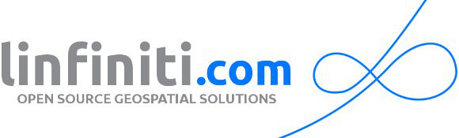
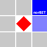
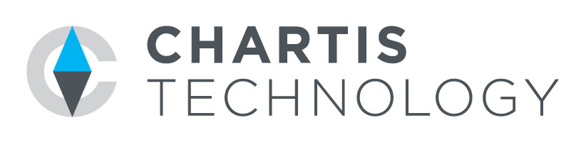
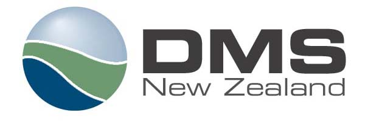
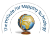
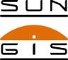
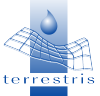

.. _QGIS-commercial_support:

==================
Commercial support
==================

Do you plan to use QGIS in your company or organization, but worry about whether there is commercial support available? Here is an alphabetical list, divided in categories, of support contractors.

.. note:: we take responsibility for the accuracy, reliability or completeness of the provided information for **Core contributors** only.

Core contributors
------------------

.. |3liz| image:: images/3liz.png
   :height: 80 px

|3liz| `3liz <http://www.3liz.com/>`_ (based in France) offers a full range of services around QGIS, to escort all software users, from beginners to the insiders. Depending on your needs, 3Liz gives training sessions to QGIS, provides the Web mapping portal LizMap - based on QGIS Desktop & QGIS Serveur - which allows easy publication of data on the Web, and also proposes support, development and consulting on QGIS.

----

   
|bernaweb| `bernawebdesign <http://bernawebdesign.ch/>`_ (Switzerland) provides commercial support, training and programming for QGIS and QGIS on Android.

----

|dms| `Digital Mapping Solutions <http://www.mapsolutions.com.au/>`_ (based in Australia) has been working with Government and Commercial organisations for over 15 years and have the products, services and skills to help you take full advantage of your GIS investment. DMS provides support, training, custom devlopment, bug fixing, consulting, for QGIS.

----

|faunalia| `Faunalia <http://www.faunalia.eu/>`_ (based in Italy, Portugal, and operating worldwide) provides development services (both core and plugins), training, and commercial support for QGIS, GRASS, GDAL/OGR, and PostgreSQL/PostGIS.

----

|gbd-consult| `GBD-consult <http://www.gbd-consult.de/>`_ (based in Düsseldorf, Germany) provides commercial consulting, training and support for QGIS, GRASS and other FOSS applications.

----

|linfin| `Linfiniti Consulting <http://linfiniti.com/>`_ (based in Swellendam, South Africa), we provide commercial support and training for QGIS and GRASS.

----

.. |nextgis| image:: images/nextgis.gif
   :width: 160 px

|nextgis| `NextGIS <http://nextgis.org/>`_ (based in Moscow, Russia) provides commercial support, custom programming and training for QGIS, PostGIS and GRASS.

----

|norbit| `norBIT GmbH <http://www.norbit.de/64>`_ (based in Norden, Germany) provides commercial support and custom programming for QGIS.

------

|oslandia| `Oslandia <http://www.oslandia.com/?page_id=20>`_ (based in France) provides services on OpenSource GIS. Oslandia offers training, support, development and consulting, namely on QGIS and PostGIS.

------

|sourcepole| `Sourcepole <http://www.sourcepole.com/>`_ (based in Zurich, Switzerland and operating worldwide) provides FOSSGIS training, commercial support and maintenance contracts as well as cloud based geo hosting for QGIS. With three leading core committers Sourcepole is able to offer sophisticated developments for QGIS. 

----

Contributors
------------------

|cartoexpert| `Cartoexpert <http://www.cartoexpert.com/index.php/formations/qgis-formation-quantum-gis.html>`_ (based in France) provides training for QGIS.

----

|camptocamp| `Camptocamp <http://www.camptocamp.com/en/geospatial-solutions>`_ is an Open Source service company based in Europe offering training, support and development around QGIS, mobiles apps, 3D, geoportails and GeoBI using a high expertise.

----

|gaia3d| `Gaia3D, Inc. <http://www.gaia3d.com/>`_ (based in South Korea) is a leading Open Source GIS company in Korea. Gaia3D offers professional development services, training, consulting and supports for QGIS, PostGIS, GeoServer and OpenLayers

----

|itopen| `IT Open <http://www.itopen.it/>`_ (based in Luserna san Giovanni (TO) Italy) provides IT Solutions for free companies.

----

|lutra_consulting| `Lutra Consulting <http://www.lutraconsulting.co.uk/>`_ (based in the UK) provide training, support and bespoke software development services for QGIS.

----

|wmlogo| `Webmapper <http://www.webmapper.nl/>`_ (Based in Utrecht, The Netherlands). We focus on creating usable web mapping solutions and consultancy services in the fields of web cartography and GIS.

Others
------------------

|astun| `Astun Technology <http://astuntechnology.com/>`_ (based in UK) provides training for QGIS.

----

|agx| `AdventGX <http://www.adventgx.com/>`_ (based in College Station, TX) provides installation, training, and implementation support for QGIS.

----

|bev| `Bird's Eye View GIS <http://www.adventgx.com/>`_ (Based in Albuquerque, New Mexico) provides commercial GIS services and support and training in QGIS, GRASS GIS and other FOSS GIS applications.

----

|chartis| `Chartis Technology <http://www.chartistechnology.com/>`_ (based in Australia) specialise in developing and implementing spatial technology. We provide QGIS support, services and training to bring meaningful outcomes to customers with traditionally high barriers of entry.

----

|dmsnz| `Digital Mapping Solutions New Zealand <http://www.mapsolutions.co.nz/>`_ (based in New Zeland) is a relatively new venture coming up on 4 years in a dynamic ever changing Spatial Industry.  DMS NZ brings years of local government experience in deploying web based mapping solutions.  DMS NZ now supports QGIS and provides services such as QGIS training at all levels, consulting, and support for all QGIS users.

----

|gis3w| `GIS3W <http://www.gis3w.it/>`_ (based in Italy) provide geographic and ecological analysis services and support and assistance with QGIS.

----

|karttakeskus| `Karttakeskus <http://www.karttakeskus.fi/>`_ (based in Finland) provides commercial support and training for QGIS and open spatial data.

----

|imt| `The Institute For Mapping Technology <http://learninggis.com/>`_ (based in Austin, TX) provides support and training for QGIS and PostGIS.

----

|ngnuity| `nGNUity.net- <http://ngnuity.net/>`_ FOSS advocate from the Philippines providing commercial GIS services, training, and consulting for QGIS (QGIS), spatial data visualization assistance to local governments, non-profits, research agencies and community groups since 2007. Offers various mobile data collection and mapping services using the Open Data Kit / KoBo Toolbox software stack.

----

|northriver| `North River Geographic Systems, Inc <http://www.northrivergeographic.com/>`_ is a small GIS Consulting firm located in the Southeastern United States. We provide Geospatial services such as data conversion, ESRI and FOSS4G software support, cartography, and data analysis.

----

|sungis| `SunGIS <http://www.sungis.lv/>`_ (based in Valmiera, Latvia) provides commercial support, consulting, data processing and custom programming for QuantumGIS, GRASS GIS and FOSS GIS based SDI solutions.

----

|terrestris| `Terrestris <http://www.terrestris.de/dienstleistungen/schulungen/>`_ (Bonn, Germany) provides commercial services and training for QGIS.
