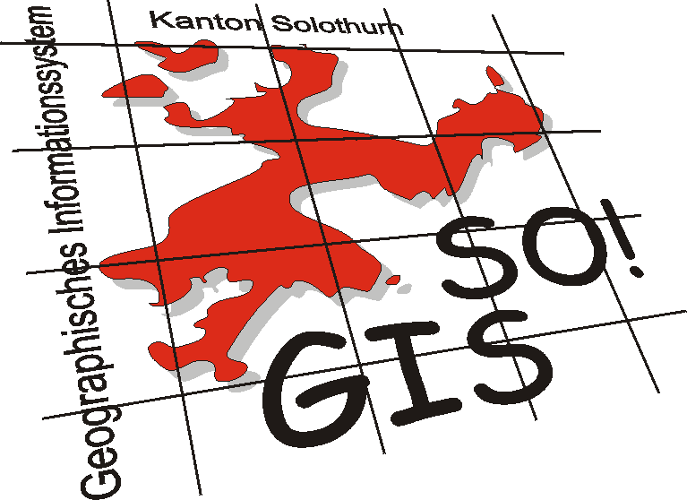
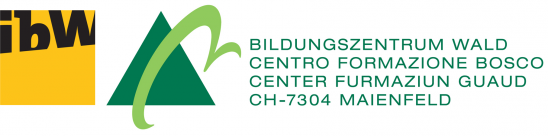
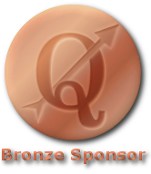
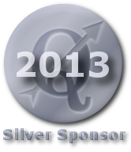
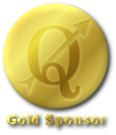

.. _QGIS-sponsoring:

===============
Sponsoring QGIS
===============

QGIS is an entirely Open Source project. QGIS development is carried out largely by a group of volunteers, that in time have built up a large, valuable and useful code base, free to use and improve for everybody. As a result, you have free access to the source code and binaries that we provide on our web site. As a result of this volunteer approach, a number of tasks, less interesting or important for the developers, are sometimes left behind. In addition, promoting QGIS requires our participation at congresses and conferences and the production of information material, sometimes very expensive for volunteer developers.

Meanwhile, many organizations have made an investment in using QGIS as part of their operations, but have not had a way to directly contribute to the success and long-term health of the project.

We would like to extend our activities and improve the quality of QGIS. Your financial contribution will support the maintenance, improvement, and promotion of QGIS. Sponsorship is not a way for individuals to control the development of the project, but rather a way of ensuring the longevity and overall health of the project.

With your donations we were able to fund several developer meetings, starting from that in Vienna, autumn 2009. Users donations, with the co-sponsoring of the Italian GFOSS.it association allow us to fund travel and accommodation costs of several key developers.
Donations thus contributed effectively to the great success of the meeting.

We encourage you to donate again to the upcoming developer meetings.

How can you support the QGIS Development
----------------------------------------

There are two kinds of financial contributions, we accept:

* **sponsorships**: a sponsorship is an annual commitment of funds to the project.
* **donation**: a donation is a once off financial contribution to the QGIS project.

Sponsorship
...........

Sponsors can sponsor Quantum GIS for any amount of money of at least 500 €/700 US$. Sponsorships last one year, after which they may be continued with a new payment, or allowed to lapse. At or above the following levels a sponsor will be designated as being one of the following class:

* 27,000+ €/39,000 US$: Platinum Sponsor
* 9,000+ €/13,000 US$: Gold Sponsor
* 3,000+ €/4,300 US$: Silver Sponsor
* 500+ €/700 US$: Bronze Sponsor

List of sponsors
++++++++++++++++

Annually we also receive support from various organisations who appreciate the work we do and would like to facilitate the sustained development effort that goes into the project. For more information on sponsoring QGIS, please visit the sponsorship page. These sponsors are listed below with our thanks!

|gold|
|aas_long|

`ASIA AIR SURVEY <http://www.asiaairsurvey.com/>`_, Japan (11.2012-10.2015)

----

|silver| |land_f|

`State of Vorarlberg <http://www.vorarlberg.at/>`_, Austria (3.2013)
 
.. |land_f| image:: images/land_f.jpg
   :width: 290 px

----

.. image:: images/gfoss.png
   :width: 150 px
   :align: left

We would like to thank GFOSS.it, the Italian Free and Open Source Software organisation for the sponsorship they provided to the QGIS project until early 2012. Visit `GFOSS.it <http://gfoss.it/>`_ for more information (site mainly in Italian).

----

.. image:: images/osgeo.png
   :width: 100 px
   :align: left

Also `OSGeo <http://www.osgeo.org/>`_ is partly supporting our HackFests: 2012.10 in Essen, Germany, and 2013.04 in Valmiera, Latvia.

----

|silver| |sogis|

`Kanton Solothurn <http://www.agi.so.ch/>`_, Switzerland (10.2012)
 

----

|bronze| |fossgisev|

`www.fossgis.de <http://www.fossgis.de/>`_, Germany (8.2012) 
 
.. |fossgisev| image:: images/fossgisev.png
   :width: 140 px

----

|bronze| |argus|

`www.argusoft.de <http://www.argusoft.de/>`_, Germany (6.2012) 
 
.. |argus| image:: images/argus.jpg
   :width: 130 px

----

|bronze| |geosynergy|

`www.geosynergy.com.au <http://www.geosynergy.com.au/>`_, Australia (5.2012)
 
.. |geosynergy| image:: images/geosynergy.jpg
   :width: 150 px

----

|bronze| |ibw_bzwm|

`ibW Bildungszentrum Wald <http://www.bzwmaienfeld.ch/>`_, Switzerland (3.2012)

----

|silver| |sogis|

`Kanton Solothurn <http://www.agi.so.ch/>`_, Switzerland (4.2011)

.. sogis as image already defined above

----

|silver| |land_f|

`State of Vorarlberg <http://www.vorarlberg.at/>`_, Austria (11.2011)

.. land_f image already defined above

----

|bronze| |uster|

`City of Uster <http://gis.uster.ch/>`_, Switzerland (11.2011)

.. |uster| image:: images/uster.gif
   :width: 100 px

----

|bronze| |municipia|

`Municípia, SA <http://www.municipia.pt/>`_, Portugal (2.2011)
 
.. |municipia| image:: images/municipia.jpg
   :width: 78 px

----

|bronze| |gfosservices|

`Studio Associato Gfosservices <http://www.gfosservices.com/>`_, Italy (2.2010) 

.. |gfosservices| image:: images/gfosservices.jpg
   :width: 55 px

----

|bronze| |nextgis|

`NextGIS <http://nextgis.org/>`_, Russia (3.2010)

Donation
........

Donations can be of any amount, through the `Make A Donation PayPal <https://www.paypal.com/us/cgi-bin/webscr?cmd=_flow&SESSION=AdBwoAp9yoTKrVYVX_a8x5uNGxn6jbzjkZVnJaTIqW6pVT4i_Ns6S3DVWym&dispatch=5885d80a13c0db1f8e263663d3faee8d96fc0752e9614158f04872d2f2ae25dc>`_ link provided also in the menu of this website or through our bank account (write us for details: cavallini at faunalia dot it). Even a small donation can make a difference and help to reach important project goals!

If you wish to send us a larger donation, you are strongly encouraged to use the bank account rather than PayPal.

List of donors
++++++++++++++

* Aaron Racicot
* Adam Lane
* Adrian Cooke
* Adrian Matter
* Albin Blaschka
* Alessandro Fanna
* Alessandro Pasotti
* Alessandro Sarretta
* Alexandre Leroux
* Amedeo Fadini
* Anders Skoglund
* Andrea Peri
* Andreas Fuchs
* Andreas Neumann
* Andreas Schmid
* Andrew Chapman
* Andrew Rigby
* Andrey Kuvshinov
* Associazione Monte Porzio Cultura
* Attila Toth
* Bayard Ewing
* Bernd Vogelgesang
* Birgit Konn
* Boštjan Krapež
* Brian Kelly
* Carl Nelson
* Carsten Fink
* Cheryle Shepstone
* Chipotle Coupons
* Chris Talbot
* Christopher Kahler
* Cristian Spieles
* Christian Schwartze
* D R Arbib
* David Vaarwerk
* Dheeraj Chand
* Didier Genier
* Dirk Pflugmacher
* David Enns
* Dariusz Bobak
* Doswald Cornel
* Douglas Lane
* Dušan Pavlík
* Ecotrust
* Emanuele Zamprogno
* Erwin Bauer
* Evan Wolf
* Fabian Frucht
* Ferdinando Urbano
* Flavio Rigolon
* Florian Hof
* Fornat AG, Zürich
* FOSSGIS e.V.
* Fred Watchorn
* Fred Ethève
* Gabriele Monfardini
* Gabriela Casares
* Geoff Jones
* George Smith
* Gerald Bond
* Gérald Fringeli
* Gerhard Spieles
* GFOSS.it
* Giovanni Fossà
* Giuseppe Patti
* Glasic S.r.l.
* Gregorio Díaz-Marta Mateos
* Guenther Moeller
* Guillaume Raspini
* Håvard Gåseidnes
* Heinrich Schweizer
* Hiroshi Kawakami
* Hiroto Okayama
* Ian Wusstig
* Igor Zabelin
* Ivan Mincik
* Ivan Marchesini
* Jake Maier
* James Larsen
* James Crone
* Jaroslaw Kowalczyk
* Jason Jorgenson
* Jean Denis Giguère
* Jean Roc Morreale
* Jean Sébastien Dehecq
* Jim Litts
* Jim Mann
* Johannes Lauber
* John C. Tull
* John Dean
* John Milligan
* Jorge Pintocorne
* José Alfonso de Tomás Gargantilla
* Jose Augusto Faes
* Junji Yamakawa
* K Brock Riedell
* Kai Li
* Kanton Solothurn SOGIS
* Kenton Ngo
* Kevin Hansen
* Kevin Shook
* Klaus Sterzenbach
* Kristian Stadelmayr
* Kurt Esko
* Laura Burnette
* Lorenzo Becchi
* Luca Casagrande
* Luca Manganelli
* Lutz Bornschein
* Maciej Sieczka
* Maciej Latek
* Marc Monnerat
* Mark Siebel
* Mark Douglas
* Mark Hoschek
* Maria Antonia Brovelli
* Marselle Sjoden
* Massimo Cuomo
* Mateusz Loskot
* Matt Foy
* Matt Wilkie
* Michael Schweizer
* Miguel Fernández Astudillo
* Mikhail Sivakov
* Mohamed Al Merri
* Murray Swanson
* Niccolo Rigacci
* Nikolaos Alexandris
* Nikolaou Konstantinos
* Oliver Schonrock
* Oriental Rugs Online
* Osvaldo Mascetti
* Otto Dassau
* Pablo Torres Carreira
* Paolo Cavallini
* Paolo Livio Craveri
* Patti Giuseppe
* Peter Löwe
* Peter Paudits
* Peter Wells
* Planetek Italia s.r.l
* Productive Water Services
* Radoslaw Pasiok
* Ragnvald Larsen
* Ralph Hames
* Ralph Williams
* Ramon Andinach
* Raymond Warriner
* Reiko Hayashi
* Riccardo Giaccari
* Richard Duivenvoorde
* Robert Nuske
* Robert Thurston
* Roberta Benetti
* Russell Rew
* Sake Wagenaar
* Sergey Khokhlov
* Shapesmart
* Silvio Grosso
* Spencer Gardner
* Stefan Ziegler
* Stefan Price
* Stefano Menegon
* Steffen Götze
* Stephan Holl
* Sti Sas Di Meo
* Thanasis Karathanasis
* Thierry Gonon
* Tim Baggett
* Tishampati Dhar
* Tomas Trojacek
* Thomas Dunz
* Thomas Engleder
* Tyler Mitchell
* Ujaval Gandhi
* Umberto Zulian
* Wendelin Schmit
* Werner Macho
* William Levering
* Yves Jacolin
* Zachary Patterson

Your benefit sponsoring QGIS
----------------------------

Sponsoring the Quantum GIS project provides the following benefits:

* Ensures the sustainability and health of the QGIS project.
* All sponsors will be listed on the project sponsor page, ordered by contribution class (Platinum, Gold, Silver, Bronze) with a link back to the sponsor.

  * *Platinum Sponsors* will have their logo placed on rotating banner on front page of qgis.osgeo.org
  * *Gold Sponsors* will be listed on the sponsors page with a large logo (60k pixel, e.g. 300x200px)
  * *Silver sponsors* will be listed on the sponsors page with a medium size logo (30k pixel, e.g. 200x150px)
  * *Bronze sponsors* will be listed on the sponsors page with a small size logo (6k pixel, e.g. 100x60px)
  * after the expiring of the sponsorship year, logos will be kept until space will allow, reducing their size by a half

* Sponsors will be listed in the front matter of the QGIS manual
* Sponsors will be allowed to use a special version of the QGIS logo on their web site and promotional materials, which shows they are a sponsor of the QGIS project

No advertising will be placed within the QGIS application itself.

How do we use financial support
-------------------------------

The sponsorship funds will be spent to directly improve the code base of the project, to fund tasks that generally receive less attention from developers, and to fund work on peripheral project tasks so that core contributors can focus efforts on QGIS improvements. As examples, we fund the following project activities:

* **QGIS Developer Meetings** where we can meet in person and brainstorm, fix bugs and hold a week of intensive QGIS development work. Most QGIS developers will happily donate their time to such events, but we are looking for sponsors to cover travel, accommodation and subsistence costs for these events
* fund developers to work on specific aspects of QGIS including implementing **new features** and **fixing bugs**
* attendance to other conferences. There are several high profile conferences held each year (such as the http://www.foss4g.org), and we would like to be able to fund QGIS team members to **represent QGIS at important conferences**, to promote it among users and raise interest and solicit code contributions from other developers.

Decisions on spending of sponsorship funds will be made by the *QGIS Project Steering Committee*.

.. note:: We regret that we cannot accept 'earmarked' funding as it creates many administrative issues. If you are interested in funding specific aspects of QGIS development, we encourage you to allocate additional human resources to the project, e.g. hiring a developer, or participating to our bug fixing initiative.

.. note:: Acceptance of sponsorship offers is at the discretion of the QGIS PSC. We reserve the right to decline offers of sponsorship if the sponsoring organisation or party seems to be at odds with the ethos of our project. For example offers from marketing companies that have nothing to do with GIS /spatial services, or offers where we have reason to believe the presence of  the sponsors logo and marketing materials on our site and other materials will degrade the experience of our users will be declined.

Organizations or individuals interested in sponsoring the QGIS project should contact the **QGIS PSC Finance and Marketing advisor**, Paolo Cavallini at: cavallini at faunalia dot it (+39-348-3801953) with questions, or to make arrangements.

