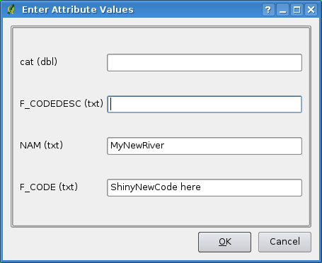

.. _label_workingvector:

==========================
 Working with Vector Data
==========================

|qg| uses the OGR library to read and write vector data formats [#]_, 
including ESRI shapefiles, MapInfo and Microstation file formats; Postgis, 
Spatialite, Oracle spatial databases and many more. At the date of this 
document, 69 vector formats are supported by the OGR library (see OGR-SOFTWARE-SUITE :ref:`literature_and_web`). 
The complete list is available at http://www.gdal.org/ogr/ogr_formats.html.

.. note:: 

   Not all of the listed formats may work in |qg| for various reasons. 
   For example, some require external commercial libraries or the GDAL/OGR 
   installation of your OS was not build to support the format you want to use. 
   Only those formats that have been well tested will appear in the list of 
   file types when loading a vector into |qg|. Other untested formats can be 
   loaded by selecting `*.*`. 

Working with GRASS vector data is described in Section :ref:`grass`.

This section describes how to work with several common formats: ESRI 
shapefiles, PostGIS layers and Spatialite layers. Many of the features 
available in |qg| work the same, regardless of the vector data source. 
This is by design and includes the identify, select, labeling and 
attributes functions.

.. index:: ESRI, Shapefile, OGR

.. _vector_shapefiles:

ESRI Shapefiles
===============

The standard vector file format used in |qg| is the ESRI Shapefile. 
Support is provided by the :index:`OGR Simple Feature Library` 
( http://www.gdal.org/ogr/ ).

A shapefile actually consists of several files. 
The following three are required:

#.  :file:`.shp` file containing the feature geometries.
#.  :file:`.dbf` file containing the attributes in dBase format.
#.  :file:`.shx` index file.

Shapefiles also can include a file with a :file:`.prj` suffix, which 
contains the projection information. While it is very useful to have a 
projection file, it is not mandatory. A shapefile dataset can contain 
additional files. 
For further details see the ESRI technical specification at: 
http://www.esri.com/library/whitepapers/pdfs/shapefile.pdf.

.. _vector_load_shapefile:

Loading a Shapefile
-------------------

|mActionAddNonDbLayer| To :index:`load a shapefile`, start |qg| and 
click on the |mActionAddNonDbLayer| :sup:`Add Vector Layer` toolbar 
button or simply type :kbd:`Ctrl+Shift+V`. This will bring up a new 
window (see figure_vector_1_).

.. _figure_vector_1:
.. figure:: img/en/Addvectorlayerdialog.png
   :align: center

   Figure Vector 1: Add Vector Layer Dialog |nix|

From the available options check |radiobuttonon| :guilabel:`File`. 
Click on button **[Browse]**. That will bring up a standard open file 
dialog (see figure_vector_2_) which allows you to navigate the file system 
and load a shapefile or other supported data source. 
The selection box :guilabel:`Files of type` |selectstring| allows you to 
preselect some OGR supported file formats.

You can also select the Encoding type for the shapefile if desired.

.. _figure_vector_2:
.. figure:: img/en/shapefileopendialog.png
   :width: 40em
   :align: center

   Figure Vector 2: Open an OGR Supported Vector Layer Dialog |nix|

Selecting a shapefile from the list and clicking **[Open]** loads it 
into |qg|. Figure_vector_3_ shows |qg| after loading 
the :file:`alaska.shp` file.

.. _figure_vector_3:
.. figure:: img/en/shapefileloaded.png
   :width: 40em
   :align: center

   Figure Vector 3: |qg| with Shapefile of Alaska loaded |nix|

.. _tip_layer_colors:

.. tip:: **Layer Colors**

   When you add a layer to the map, it is assigned a random color. 
   When adding more than one layer at a time, different colors are assigned 
   to each layer.

Once loaded, you can zoom around the shapefile using the map navigation tools. 
To change the style of a layer, open the :guilabel:`Layer Properties` dialog 
by double clicking on the layer name or by right-clicking on the name in the 
legend and choosing :menuselection:`Properties` from the popup menu. 
See Section :ref:`vector_style_tab` for more information on setting 
symbology of vector layers.

.. _tip_load_from_external_drive_OSX:

.. tip:: **Load layer and project from mounted external drives on OS X**

   On OS X, portable drives that are mounted besides the primary hard drive 
   do not show up under :menuselection:`File --> Open Project` as expected. 
   We are working on a more OSX-native open/save dialog to fix this. 
   As a workaround you can type '/Volumes' in the File name box and press 
   :kbd:`return`. Then you can navigate to external drives and network mounts.

.. _vector_improving_performance_shape:

Improving Performance Shape
---------------------------

To improve the performance of drawing a shapefile, you can create a spatial 
index. A spatial index will improve the speed of both zooming and panning. 
Spatial indexes used by |qg| have a :file:`.qix` extension.

Use these steps to create the index:

*  Load a shapefile.
*  Open the :guilabel:`Layer Properties` dialog by double-clicking on the 
   shapefile name in the legend or by right-clicking and choosing 
   :menuselection:`Properties` from the popup menu.
*  In the tab :guilabel:`General` click the **[Create Spatial Index]** button.

.. _vector_shape_problem_loading:

Problem loading a shape .prj file
---------------------------------

If you load a shapefile with :file:`.prj` file and |qg| is not able to read 
the coordinate reference system from that file, you have to define the 
proper projection manually within the :guilabel:`General` tab of the 
:guilabel:`Layer Properties` dialog of the layer. 
This is due to the fact, that :file:`.prj` files often do not provide the 
complete projection parameters, as used in |qg| and listed in the 
:guilabel:`CRS` dialog.

For that reason, if you create a new shapefile with |qg|, two different 
projection files are created. A :file:`.prj` file with limited projection 
parameters, compatible with ESRI software, and a :file:`.qpj` file, 
providing the complete parameters of the used CRS. Whenever |qg| finds 
a :file:`.qpj` file, it will be used instead of the :file:`.prj`.

.. index:: MapInfo

.. _vector_loading_mapinfo:

Loading a MapInfo Layer
=======================

|mActionAddNonDbLayer| To load a MapInfo layer, click on the 
|mActionAddNonDbLayer| :sup:`Add Vector Layer` toolbar button or type 
:kbd:`Ctrl+Shift+V`, change the file type filter to  
:guilabel:`Files of Type [OGR] MapInfo (*.mif *.tab *.MIF *.TAB)` 
|selectstring| and select the .TAB or .tab layer you want to load.

.. index:: ArcInfo_Binary_Coverage, Tiger_Format, UK_National_Transfer_Format
.. index:: US_Census_Bureau

.. _vector_loading_arcinfo_coverage:

Loading an ArcInfo Binary Coverage
==================================

|mActionAddNonDbLayer| To load an ArcInfo binary coverage, click on 
the |mActionAddNonDbLayer| :sup:`Add Vector Layer` toolbar button or 
type :kbd:`Ctrl+Shift+V` to open the :guilabel:`Add Vector Layer` dialog. 
Select |radiobuttonon| :guilabel:`Directory`. 
Change to  :guilabel:`Type Arc/Info Binary Coverage` |selectstring|. 
Navigate to the directory that contains the coverage files and select it.

Similarly, you can load directory based vector files in the UK National 
Transfer Format as well as the raw TIGER Format of the US Census Bureau.

.. index:: PostGIS, PostgreSQL

.. _label_postgis:

PostGIS Layers
==============

PostGIS layers are stored in a PostgreSQL database. The advantages of 
PostGIS are the spatial indexing, filtering and query capabilities it 
provides. Using PostGIS, vector functions such as select and identify 
work more accurately than with OGR layers in |qg|.

.. index:: Connection_Manager

.. _vector_create_stored_connection:

Creating a stored Connection
----------------------------

|mActionAddLayer| The first time you use a PostGIS data source, you must 
create a connection to the PostgreSQL database that contains the data. 
Begin by clicking on the |mActionAddLayer| :sup:`Add PostGIS Layer` toolbar 
button, selecting the |mActionAddLayer| :menuselection:`Add PostGIS Layer...` 
option from the :menuselection:`Layer` menu or typing :kbd:`Ctrl+Shift+D`. 
You can also open the :guilabel:`Add Vector Layer` dialog and select 
|radiobuttonon| :guilabel:`Database`.
The :guilabel:`Add PostGIS Table(s)` dialog will be displayed. To access 
the connection manager, click on the **[New]** button to display 
the :guilabel:`Create a New PostGIS Connection` dialog. The parameters 
required for a connection are shown in table :ref:`table_connections`.

Optional you can activate following checkboxes:

*  |checkbox| :guilabel:`Save Username`
*  |checkbox| :guilabel:`Save Password`
*  |checkbox| :guilabel:`Only look in the geometry_columns table`
*  |checkbox| :guilabel:`Only look in the 'public' schema`
*  |checkbox| :guilabel:`Also list tables with no geometry`
*  |checkbox| :guilabel:`Use estimated table metadata`

Once all parameters and options are set, you can test the connection 
by clicking on the **[Test Connect]** button.

.. _table_connections:

==============  ================================================================================
Name            A name for this connection. Can be the same as *Database*
==============  ================================================================================
Service         Service parameter to be used alternatively to hostname/port (and potentially database). This can be defined in pg\_service.conf
Host            Name of the database host. This must be a resolvable host name the same as would be used to open a telnet connection or ping the host. If the database is on the same computer as |qg|, simply enter *'localhost'* here.
Port            Port number the PostgreSQL database server listens on. The default port is 5432.
Database        Name of the database.
SSL mode        How the SSL connection will be negotiated with the server. These are the options:

                + disable: only try an unencrypted SSL connection
                + allow: try a non-SSL connection, if that fails, try an SSL connection
                + prefer (the default): try an SSL connection, if that fails, try a 
                  non-SSL connection;
                + require: only try an SSL connection.

                Note that massive speedups in PostGIS layer rendering can be achieved by disabling SSL in the connection editor.
username        User name used to login to the database.
Password        Password used with *Username* to connect to the database.
==============  ================================================================================

   **Table PostGIS Connection Parameters**

.. _tip_settings_security:

.. tip:: **QGIS User Settings and Security**

   Your customized settings for |qg| are stored based on the operating system. 

   * |nix|, the settings are stored in your home directory in :file:`.qgis/`. 
   * |win|, the settings are stored in the registry. 

   Depending on your computing environment, storing passwords in your |qg| 
   settings may be a security risk.

.. _vector_loading_postgis:

Loading a PostGIS Layer
-----------------------

|mActionAddLayer| Once you have one or more connections defined, you can 
load layers from the PostgreSQL database. Of course this requires having 
data in PostgreSQL. See Section :ref:`vector_import_data_in_postgis` for 
a discussion on importing data into the database.

To load a layer from PostGIS, perform the following steps:

*  If the :guilabel:`Add PostGIS Table(s)` dialog is not already open, 
   click on the |mActionAddLayer| :sup:`Add PostGIS Layer` toolbar button.
*  Choose the connection from the drop-down list and click **[Connect]**.
*  Select or unselect |checkbox| :guilabel:`Also list tables with no geometry`
*  Optionally use some |checkbox| :guilabel:`Search Options` to define 
   which features to load from the layer or use the **[Build query]** button 
   to start the Query builder dialog.
*  Find the layer(s) you wish to add in the list of available layers.
*  Select it by clicking on it. You can select multiple layers by holding 
   down the :kbd:`Shift` key while clicking. See Section 
   :ref:`vector_query_builder` for information on using the PostgreSQL 
   Query Builder to further define the layer.
*  Click on the **[Add]** button to add the layer to the map.

.. _tip_postgis_layers:

.. tip:: **PostGIS Layers**

   Normally a PostGIS layer is defined by an entry in the geometry_columns 
   table. From version 0.9.0 on, |qg| can load layers that do not have an 
   entry in the geometry_columns table. This includes both tables and views.
   Defining a spatial view provides a powerful means to visualize your data. 
   Refer to your PostgreSQL manual for information on creating views.

.. _sec_postgis_details:

Some details about PostgreSQL layers
------------------------------------

This section contains some details on how |qg| accesses PostgreSQL layers. 
Most of the time |qg| should simply provide you with a list of database 
tables that can be loaded, and load them on request. However, if you have 
trouble loading a PostgreSQL table into |qg|, the information below may 
help you understand any |qg| messages and give you direction on changing 
the PostgreSQL table or view definition to allow |qg| to load it.

|qg| requires that PostgreSQL layers contain a column that can be used 
as a unique key for the layer. For tables this usually means that the table 
needs a primary key, or a column with a unique constraint on it. In |qg|, 
this column needs to be of type int4 (an integer of size 4 bytes). 
Alternatively the ctid column can be used as primary key. If a table lacks 
these items, the oid column will be used instead. Performance will be 
improved if the column is indexed (note that primary keys are automatically 
indexed in PostgreSQL).

If the PostgreSQL layer is a view, the same requirement exists, but views 
do not have primary keys or columns with unique constraints on them. 
In this case |qg| will try to find a column in the view that is derived 
from a suitable table column. It does this by parsing the view definition 
SQL. However there are several aspects of SQL that |qg| ignores these 
include the use of table aliases and columns that are generated by SQL 
functions.

If a suitable column cannot be found, |qg| will not load the layer. 
If this occurs, the solution is to alter the view so that it does include 
a suitable column (a type of int4 and either a primary key or with a 
unique constraint, preferably indexed).

.. %FIXME: Add missing information
.. % When dealing with views, |qg| parses the view definition and

.. index:: shp2pgsql

.. _loading_postgis_data:

.. _vector_import_data_in_postgis:

Importing Data into PostgreSQL
------------------------------

**shp2pgsql**

Data can be imported into PostgreSQL using a number of methods. PostGIS 
includes a utility called **shp2pgsql** that can be used to import 
shapefiles into a PostGIS enabled database. For example, to import a 
shapefile named :file:`lakes.shp` into a PostgreSQL database named 
``gis_data``, use the following command:

::

  shp2pgsql -s 2964 lakes.shp lakes_new | psql gis_data

This creates a new layer named ``lakes_new`` in the ``gis_data`` database. 
The new layer will have a spatial reference identifier (SRID) of 2964. 
See Section :ref:`label_projections` for more information on spatial 
reference systems and projections.

.. index:: pgsql2shp

.. _tip_export_from_postgis:

.. tip:: **Exporting datasets from PostGIS**

   Like the import-tool **shp2pgsql** there is also a tool to export 
   PostGIS-datasets as shapefiles: **pgsql2shp**. This is shipped within 
   your PostGIS distribution.

.. index:: SPIT, Shapefile_to_Postgis_Import_Tool

.. _spit_plugin:

**SPIT Plugin**

|spiticon| |qg| comes with a plugin named SPIT (Shapefile to PostGIS 
Import Tool). SPIT can be used to load multiple shapefiles at one time 
and includes support for schemas. To use SPIT, open the Plugin Manager 
from the :menuselection:`Plugins` menu, check the box next to the 
|checkbox| :guilabel:`SPIT plugin` and click **[OK]**. The SPIT icon 
will be added to the plugin toolbar.

To import a shapefile, click on the |spiticon| :sup:`SPIT` tool in the 
toolbar to open the :guilabel:`SPIT - Shapefile to PostGIS Import Tool` 
dialog. Select the PostGIS database you want to connect to and click 
on **[Connect]**. If you want, you can define or change some import options. 
Now you can add one or more files to the queue by clicking on the 
**[Add]** button. To process the files, click on the **[OK]** button. 
The progress of the import as well as any errors/warnings will be displayed 
as each shapefile is processed.

.. _tip_importing_shapefiles:

.. tip:: **Importing Shapefiles Containing PostgreSQL Reserved Words**

   If a shapefile is added to the queue containing fields that are reserved 
   words in the PostgreSQL database a dialog will popup showing the status of 
   each field. You can edit the field names prior to import and change any that 
   are reserved words (or change any other field names as desired). Attempting 
   to import a shapefile with reserved words as field names will likely fail.

.. index:: ogr2ogr

**ogr2ogr**

Beside **shp2pgsql** and **SPIT** there is another tool for feeding geodata 
in PostGIS: **ogr2ogr**. This is part of your GDAL installation. 

To import a shapefile into PostGIS, do the following:
::

  ogr2ogr -f "PostgreSQL" PG:"dbname=postgis host=myhost.de user=postgres \
  password=topsecret" alaska.shp

This will import the shapefile :file:`alaska.shp` into the PostGIS-database 
*postgis* using the user *postgres* with the password *topsecret* on host 
server *myhost.de*.

Note that OGR must be built with PostgreSQL to support PostGIS.
You can see this by typing
::

  ogrinfo --formats | grep -i post

If you like to use PostgreSQL's **COPY** \ -command instead of the default 
**INSERT INTO** method you can export the following environment-variable 
(at least available on |nix| and |osx|):
::

  export PG_USE_COPY=YES

**ogr2ogr** does not create spatial indexes like **shp2pgsl** does. You 
need to create them manually using the normal SQL-command **CREATE INDEX** 
afterwards as an extra step (as described in the next section 
:ref:`vector_improving_performance`).

.. _label_improve:

.. _vector_improving_performance:

Improving Performance
---------------------

Retrieving features from a PostgreSQL database can be time consuming, 
especially over a network. You can improve the drawing performance of 
PostgreSQL layers by ensuring that a :index:`PostGIS!spatial index` 
spatial index exists on each layer in the database. PostGIS supports 
creation of a :index:`GiST (Generalized Search Tree) index` to speed 
up spatial searches of the data.

The syntax for creating a GiST [#]_ index is:
::

   CREATE INDEX [indexname] ON [tablename] 
     USING GIST ( [geometryfield] GIST_GEOMETRY_OPS );

Note that for large tables, creating the index can take a long time. 
Once the index is created, you should perform a ``VACUUM ANALYZE``. 
See the PostGIS documentation (POSTGIS-PROJECT :ref:`literature_and_web`) for more information.

The following is an example of creating a GiST index:
::

  gsherman@madison:~/current$ psql gis_data 
  Welcome to psql 8.3.0, the PostgreSQL interactive terminal.

  Type:  \copyright for distribution terms
         \h for help with SQL commands
         \? for help with psql commands
         \g or terminate with semicolon to execute query
         \q to quit

  gis_data=# CREATE INDEX sidx_alaska_lakes ON alaska_lakes 
  gis_data-# USING GIST (the_geom GIST_GEOMETRY_OPS); 
  CREATE INDEX 
  gis_data=# VACUUM ANALYZE alaska_lakes; 
  VACUUM 
  gis_data=# \q 
  gsherman@madison:~/current$

.. index:: ST_Shift_Longitude

Vector layers crossing 180 |degrees| longitude
-------------------------------------------------------

Many GIS packages don't wrap vector maps, with a geographic reference 
system (lat/lon), :index:`crossing the 180 degrees longitude line`. 
As result, if we open such map in |qg|, we will see two far, distinct 
locations, that should show near each other. In Figure_vector_4_ the 
tiny point on the far left of the map canvas (Chatham Islands), should 
be within the grid, right of New Zealand main islands.

.. _figure_vector_4:
.. figure:: img/en/vectorNotWrapping.png
   :width: 40em
   :align: center

   Figure Vector 4: Map in lat/lon crossing the 180 |degrees| longitude 
   line |nix|

A workaround is to transform the longitude values using PostGIS and the 
**ST_Shift_Longitude** [#]_ function. This function reads every point/vertex 
in every component of every feature in a geometry, and if the longitude 
coordinate is < 0 |degrees| adds 360 |degrees| to it. The result would be 
a 0 |degrees| - 360 |degrees| version of the data to be plotted in a 
180 |degrees| centric map.

.. _figure_vector_5:
.. figure:: img/en/vectorWrapping.png
   :width: 40em
   :align: center

   Figure Vector 5: Crossing 180 |degrees| longitude applying the 
   **ST_Shift_Longitude** function |nix|

Usage
-----

*  Import data to PostGIS (:ref:`vector_import_data_in_postgis`) using 
   for example the PostGIS Manager plugin or the SPIT plugin
*  Use the PostGIS command line interface to issue the following command 
   (this is an example where "TABLE" is the actual name of your PostGIS table) 

   ``gis_data=# update TABLE set the_geom=ST_shift_longitude(the_geom);``
*  If everything went right you should receive a confirmation about the 
   number of features that were updated, then you'll be able to load the 
   map and see the difference (Figure_vector_5_)

.. index:: Spatialite, SQLite

.. _label_spatialite:

SpatiaLite Layers
=================

|mActionAddSpatiaLiteLayer| The first time you load data from a SpatiaLite 
database, begin by clicking on the |mActionAddSpatiaLiteLayer| 
:sup:`Add SpatiaLite Layer` toolbar button or by selecting the 
|mActionAddSpatiaLiteLayer| :menuselection:`Add SpatiaLite Layer...` option 
from the :menuselection:`Layer` menu or by typing :kbd:`Ctrl+Shift+L`.
This will bring up a window, which will allow you to either connect to a 
SpatiaLite database already known to |qg|, which you can choose from the 
dropdown menu or to define a new connection to a new database. To define a 
new connection, click on **[New]** and use the file browser to point to 
your SpatiaLite database, which is a file with a :file:`.sqlite` extension.

If you want to save a vector layer to SpatiaLite format you can do this by 
right clicking the layer in the legend. Then click on 
:menuselection:`Save as`, define the name of the output file, sqlite as 
format and the CRS and then add ``SPATIALITE=YES`` in the OGR data source 
creation option field. This tells OGR to create a SpatiaLite database. 
See also http://www.gdal.org/ogr/drv_sqlite.html.

Creating a new SpatiaLite layer
-------------------------------

If you want to create a new SpatiaLite layer, please refer to section 
:ref:`vector_create_spatialite`.

.. index:: QSpatiaLite, Spatialite_Manager, DB_Manager

.. _tip_spatialite_management_plugin:

.. tip:: **SpatiaLite data management Plugins**

   For SpatiaLite data management you can also use several Python plugins: 
   QSpatiaLite, SpatiaLite Manager or DB Manager. They can be downloaded and 
   installed with the Plugin Installer.

.. _vector_properties_dialog:

The Vector Properties Dialog
============================

The :guilabel:`Layer Properties` dialog for a vector layer provides 
information about the layer, symbology settings and labeling options. 
If your vector layer has been loaded from a PostgreSQL/PostGIS datastore, 
you can also alter the underlying SQL for the layer by invoking the 
:guilabel:`Query Builder` dialog on the ``General`` tab.
To access the :guilabel:`Layer Properties` dialog, double-click on a layer 
in the legend or right-click on the layer and select 
:menuselection:`Properties` from the popup menu.

.. _figure_vector_6:
.. figure:: img/en/vectorLayerSymbology.png
   :width: 40em
   :align: center

   Figure Vector 6: Vector Layer Properties Dialog |nix|

.. _vector_style_tab:

Style Tab
---------

.. index:: New_Symbology, Symbology_New

Since |qg| 1.4.0 a new symbology was integrated in parallel to improve and 
finally replace the old symbology. |qg| 1.7.4 now uses the new symbology as 
default, which provides a variety of improvements and new features.

A description of the old symbology is available in section 
:ref:`vector_old_symbology`.

.. _vector_new_symbology:

Understanding the new generation symbology
------------------------------------------

There are three types of symbols: marker symbols (for points), line symbols 
(for lines) and fill and outline symbols (for polygons). Symbols can consist 
of one or more symbol layers. It is possible to define the color of a symbol 
and this color is then defined for all symbol layers. Some layers may have 
the color locked - for those the color can not be altered. This is useful 
when you define the color of a multilayer symbol. Similarly, it is possible 
to define the width for line symbols, as well as size and rotation for 
marker symbols.

.. index:: Font_Marker, Simple_Marker, SVG_Marker
.. index:: Line_decoration, Marker_line, Simple_line
.. index:: Centroid_fill, SVG_fill, Simple_fill

.. _vector_symbol_types:

Available symbol layer types
----------------------------

* Point layers

  - **Font marker**: Rendering with a font.
  - **Simple marker**: Rendering with a hardcoded marker.
  - **SVG marker**: Rendering with a SVG picture.

* Line layers

  - **Line decoration**: Add a line decoration, e.g an arrow to indicate 
    line direction.
  - **Marker line**: A line rendered by repeating a marker symbol.
  - **Simple line**: Usual rendering of a line (with specified width 
    color and pen style).

* Polygon layers

  - **Centroid fill**: Fill a polygon centroid with a hardcoded marker.
  - **SVG fill**: Fill a polygon with a SVG symbol.
  - **Simple fill**: Usual rendering of a polygon (with defined fill color, 
    fill pattern and outline).
  - **Outline: Line decoration**: Add a line decoration, e.g an arrow to 
    indicate line direction.
  - **Outline: Marker line**: Use a hardcoded marker as area outline.
  - **Outline: Simple line**: Define width, color and pen style as area outline.

.. index:: Color_ramps

Color ramps
-----------

Color ramps are used to define a range of colors that can be used during 
the creation of renderers. The symbol's color will be set from the color ramp.

There are three types of color ramps:

* **Gradient**: Linear gradient from one color to some other.
* **Random**: Randomly generated colors from a specified area of color space.
* **ColorBrewer**: Create color area from a color shema and a defined number 
  of color classes.

Color ramps can be defined in the :guilabel:`Color ramp` tab of the 
:guilabel:`Style Manager` (see Section :ref:`vector_style_manager`) by 
clicking the **[Add]** button and then choosing a color ramp type.

Styles
------

A style groups a set of various symbols and color ramps. You can define 
your prefered or frequently used symbols, and can use it  without having 
to recreate it everytime. Style items (symbols and color ramps) have always 
a name by which they can be queried from the style. There is at least one 
default style in |qg| (modifiable) and the user can add further styles.

.. index:: Renderers

Renderers
---------

The renderer is responsible for drawing a feature together with the correct 
symbol. There are four types of renderers: single symbol, categorized 
(called unique color in the old symbology), graduated and rule-based. There 
is no continuous color renderer, because it is in fact only a special case 
of the graduated renderer.
The categorized and graduated renderer can be created by specifying a symbol 
and a color ramp \- they will set the colors for symbols appropriately.

Working with the New Generation Symbology
=========================================

In the :guilabel:`Style` tab you can choose one of the four renderers: single 
symbol, categorized, graduated and rule-based. Depending on the chosen 
renderer, the symbology tab provides different settings and options, that 
will be described in the following sections. The new generation symbology 
dialog also provides a **[Style Manager]** button which gives access to the 
Style Manager
(see section :ref:`vector_style_manager`). The Style Manager allows you to 
edit and remove existing symbols and add new ones.

.. _tip_change_multiple_symbols:

.. tip:: **Select and change multiple symbols**

   The New Generation Symbology allows to select multiple symbols and right 
   click to change color, transparency, size, or outline width of selected 
   entries.

.. index:: Single_Symbol_Renderer, Renderer_Single_Symbol

Single Symbol Renderer
----------------------

The Single Symbol Renderer is used to render all features of the layer using 
a single user-defined symbol. The properties, that can be adjusted in the
``Style`` tab, depend partially on the type of the layer, but all types share 
the following structure. In the top left part of the tab, there is a preview 
of the current symbol to be rendered. In the bottom part of the tab, there is 
a list of symbols already defined for the current style, prepared to be used 
via selecting them from the list. The current symbol can be modified using 
the **[Change]** button below the preview, which opens a :guilabel:`Symbol 
Properties` dialog, or the **[Change]** button right of the preview, which 
opens an ordinary :guilabel:`Color` dialog.

In the :guilabel:`Style` tab you can apart from a general layer transparency 
also define to use millimeter or map units for the size scale. And you can 
use data-defined size scale and rotation (available through **[Advanced]** 
next to **[Save as style]**). The **[Symbol levels]** button allows to enable 
and define the order in which the symbol layers are rendered (if the symbol 
consists of more than one layer).

After having done any needed changes, the symbol can be added to the list of 
current style symbols (using the **[Save as style]** button) and then easily 
be used in the future.

.. |singlesymbol_ng_point| image:: img/en/singlesymbol_ng_point.png 
   :width: 25em
.. |singlesymbol_ng_line| image:: img/en/singlesymbol_ng_line.png 
   :width: 25em
.. |singlesymbol_ng_area| image:: img/en/singlesymbol_ng_area.png
   :width: 25em

.. _figure_symbology_1:

+-----------------------------------+
| |singlesymbol_ng_point|           |
+-----------------------------------+
| a. Single symbol point properties |
+-----------------------------------+
| |singlesymbol_ng_line|            |
+-----------------------------------+
| b. Single symbol line properties  |
+-----------------------------------+
| |singlesymbol_ng_area|            |
+-----------------------------------+
| c. Single symbol area properties  |
+-----------------------------------+

   Figure Symbology 1: Single Symbolizing options |nix|

.. index:: Categorized_Renderer, Renderer_Categorized

Categorized Renderer
--------------------

The Categorized Renderer is used to render all features from a layer, using 
a single user-defined symbol, which color reflects the value of a selected 
feature's attribute. The :guilabel:`Style` tab allows you to select:

* The attribute (using the Column listbox)
* The symbol (using the Symbol dialog)
* The colors (using the Color Ramp listbox)

The **[Advanced]** button in the lower right corner of the dialog allows to 
set the fields containing rotation and size scale information.
For convenience, the list in the bottom part of the tab lists the values of 
all currently selected attributes together, including the symbols that will 
be rendered.

The example in figure_symbology_2_ shows the category rendering dialog used 
for the rivers layer of the |qg| sample dataset.

.. _figure_symbology_2:
.. figure:: img/en/categorysymbol_ng_line.png
   :width: 40em
   :align: center

   Figure Symbology 2: Categorized Symbolizing options |nix|

.. index:: Color_Ramp, Gradient_Color_Ramp, ColorBrewer, Custom_Color_Ramp

You can create a custom color ramp choosing :menuselection:`New color ramp...` 
from the Color ramp dropdown menu. A dialog will prompt for the ramp type: 
Gradient, Random, ColorBrewer, then each one has options for number of steps 
and/or multiple stops in the color ramp. See figure_symbology_3_ for an 
example of custom color ramp.

.. _figure_symbology_3:
.. figure:: img/en/customColorRampGradient.png
   :align: center

   Figure Symbology 3: Example of custom gradient color ramp with multiple 
   stops |nix|

.. index:: Graduated_Renderer, Renderer_Graduated
.. index:: Natural_Breaks_(Jenks), Pretty_Breaks, Equal_Interval, Quantile 

Graduated Renderer
------------------

The Graduated Renderer is used to render all the features from a layer, using 
a single user-defined symbol, whose color reflects the classification of a 
selected feature's attribute to a class. Like Categorized Renderer, it allows 
to define rotation and size scale from specified columns.

Analogue to the categorized rendered, the :guilabel:`Style` tab allows you to 
select:

* The attribute (using the Column listbox)
* The symbol (using the Symbol Properties button)
* The colors (using the Color Ramp list)

Additionally, you can specify the number of classes and also the mode how to 
classify features inside the classes (using the Mode list). The available 
modes are:

* Equal Interval
* Quantile
* Natural Breaks (Jenks)
* Standard Deviation
* Pretty Breaks

The listbox in the  bottom part of the :guilabel:`Style` tab lists the classes 
together with their ranges, labels and symbols that will be rendered.

The example in figure_symbology_4_ shows the graduated rendering dialog for 
the rivers layer of the |qg| sample dataset.

.. _figure_symbology_4:
.. figure:: img/en/graduatesymbol_ng_line.png
   :width: 40em
   :align: center

   Figure Symbology 4: Graduated Symbolizing options |nix|

.. Index:: Rule-based_Rendering, Rendering_Rule-based

Rule-based rendering
--------------------

The rule-based renderer is used to render all the features from a layer, 
using rule based symbols, whose color reflects the classification of a 
selected feature's attribute to a class. The rules are based on SQL 
statements. You can also use the Query Builder to create them. The dialog 
allows rule grouping by filter or scale and you can decide if you want to 
enable symbol levels or use only first matched rule.

The example in figure_symbology_5_ shows the rule-based rendering dialog 
for the rivers layer of the |qg| sample dataset.

.. _figure_symbology_5:
.. figure:: img/en/rulesymbol_ng_line.png
   :width: 40em
   :align: center

   Figure Symbology 5: Rule-based Symbolizing options |nix|

.. index:: Point_Displacement_Renderer, Renderer_Point_Displacement
.. index:: Displacement_plugin

Point displacement
------------------

The point displacement renderer is only available, if you load the 
Displacement plugin in the QGIS Plugin Manager. It offers to visualize 
all features of a point layer, even if they have the same location. To do 
this, the symbols of the points are placed on a displacement circle around 
a center symbol.

.. _figure_symbology_6:
.. figure:: img/en/poi_displacement.png
   :width: 40em
   :align: center

   Figure Symbology 6: Point displacement dialog |nix|

.. index:: Symbol_Properties

Symbol Properties
-----------------

The symbol properties dialog allows the user to specify different properties 
of the symbol to be rendered. In the top left part of the dialog, you find 
a preview of the current symbol as it will be displayed in the map canvas. 
Below the preview is the list of symbol layers. To start the symbol 
properties dialog, click the **[** |mActionOptions| **Properties...]** 
button in the :guilabel:`Style` tab of the :guilabel:`Layer Properties` dialog.

The control panels allow adding or removing layers, changing the position 
of layers, or locking layers for color changes. In the right part of the 
dialog, there are shown the settings applicable to the single symbol layer 
selected in the symbol layer list. The most important is the 
'Symbol Layer Type' combo box, which allows you to choose the layer type. The 
available options depend on the layer type (Point, Line, Polygon). The symbol 
layer type options are described in section :ref:`vector_symbol_types`.

.. |symbolproperties1| image:: img/en/symbolproperties1.png
   :width: 30em
.. |symbolproperties2| image:: img/en/symbolproperties2.png
   :width: 30em
.. |symbolproperties3| image:: img/en/symbolproperties3.png
   :width: 30em

.. _figure_symbology_7:

+------------------------------------------+
| |symbolproperties1|                      |
+------------------------------------------+
| a. Line composed from three simple lines |
+------------------------------------------+
| |symbolproperties2|                      |
+------------------------------------------+
| b. Symbol properties for point layer     |
+------------------------------------------+
| |symbolproperties3|                      |
+------------------------------------------+
| c. Filling pattern for a polygon         |
+------------------------------------------+

   Figure Symbology 7: Defining symbol properties |nix|

.. Index:: Style_Manager, Manage_Symbols, Manage_Color_Ramps

.. _vector_style_manager:

Style Manager to manage symbols and color ramps
===============================================

The Style Manager is a small helper application, that lists symbols and color 
ramps available in a style. It also allows you to add and/or remove items. 
To launch the Style Manager, click on :menuselection:`Settings --> 
Style Manager` in the main menu.

.. _figure_symbology_8:
.. figure:: img/en/stylemanager.png
   :width: 24em
   :align: center

   Figure Symbology 8: Style Manager to manage symbols and color ramps |nix|

.. index:: Old_Symbology, Symbology_Old

.. _vector_old_symbology:

Old Symbology
=============

.. note:: 
   |qg| 1.7.4 still supports the usage of the old symbology, although it is 
   recommended to switch to the new symbology, described in section 
   :ref:`vector_new_symbology`, because the old symbology will be removed in 
   one of the next releases.

If you want or need to switch back to the old symbology you can click on 
the **[Old symbology]** button in the :guilabel:`Style` tab of the 
:guilabel:`Layer Properties` dialog.

You can also make the old symobolgy the default, deactivating |checkbox| 
:guilabel:`Use new generation symbology for rendering` in the 
:guilabel:`Rendering` tab under :menuselection:`Settings -->` |mActionOptions| 
:menuselection:`Options`.

.. index:: Old_Symbology_Renderers, Renderers_Old_Symbology

The old |qg| symbology supports the following renderers:

* **Single symbol** - a single style is applied to every object in the layer.
* **Graduated symbol** - objects within the layer are displayed with different symbols classified by the values of a particular field.
* **Continuous color** - objects within the layer are displayed with a spread of colours classified by the numerical values within a specified field.
* **Unique value** - objects are classified by the unique values within a specified field with each value having a different symbol.

To :index:'change the symbology' for a layer, simply double click on its legend entry and the vector :guilabel:`Layer Properties` dialog will be shown.

.. |vectorClassifySingle| image:: img/en/vectorClassifySingle.png
   :width: 330
.. |vectorClassifyGraduated| image:: img/en/vectorClassifyGraduated.png
   :width: 330
.. |vectorClassifyContinous| image:: img/en/vectorClassifyContinous.png
   :width: 330
.. |vectorClassifyUnique| image:: img/en/vectorClassifyUnique.png
   :width: 330

.. _figure_symbology_9:

+---------------------------+---------------------------+
| |vectorClassifySingle|    | |vectorClassifyGraduated| |
+---------------------------+---------------------------+
| 1. Single symbol          | 2. Graduated Symbol       |
+---------------------------+---------------------------+
| |vectorClassifyContinous| | |vectorClassifyUnique|    |
+---------------------------+---------------------------+
| 3. Continuous color       | 4. Unique value           |
+---------------------------+---------------------------+

   Figure Symbology 9: Old Symbolizing Options |nix|

.. index:: Fill_Style, Fill_Color, Outline_Options

Style Options
-------------

Within this dialog you can style your vector layer. Depending on the 
selected rendering option you have the possibility to also classify your 
map features.

At least the following styling options apply for nearly all renderers:

* **Fill style** - Style for filling. Beside the given brushes you can 
  select :guilabel:`Fill style: ? Texture` |selectstring| and click the 
  |browsebutton| button for selecting your own texture file. Currently the 
  fileformats :file:`*.jpeg`, :file:`*.xpm`, and :file:`*.png` are supported.
* **Fill color** - fill-color of your features.
* **Outline options**

  * Outline style - Pen-style for your outline of your feature. 
    You can also set this to 'no Pen'.
  * Outline color - color of the ouline of your feature.
  * Outline width - width of your features.

Once you have styled your layer you also could save your layer-style to a 
separate file (ending with :file:`*.qml`).
To do this, use the button **[Save Style...]**. No need to say that 
**[Load Style...]** loads your saved layer-style-file.

If you wish to always use a particular style whenever the layer is loaded, 
use the **[Save As Default]** button to make your style the default. Also, 
if you make changes to the style that you are not happy with, use the 
**[Restore Default Style]** button to revert to your default style.

.. index:: Vector_Transparency, Transparency_Vector

Vector transparency
-------------------

|qg| allows to set a transparency for every vector layer. This can be done 
with the slider :guilabel:`Transparency` |slider| inside the 
:guilabel:`Style` tab. This is very useful for overlaying several vector 
layers.

.. index:: Labeling_Engine, Labeling_New, Labeling_Old

.. _vector_labels_tab:

Labels Tab
----------

As for the symbology |qg| 1.7.4 currently provides an old and a new labeling 
engine in parallel. The :guilabel:`Labels` tab still contains the old 
labeling. The new labeling is implemented as a core application and will 
replace the features of the old labels tab in one of the next versions.

We recommend to switch to the new labeling, described in section 
:ref:`vector_new_labeling`.

The old labeling in the :guilabel:`Labels` tab allows you to enable labeling 
features and control a number of options related to fonts, placement, style, 
alignment and buffering. We will illustrate this by labeling the lakes 
shapefile of the :file:`QGIS_example_dataset`:

#.  Load the Shapefile :file:`alaska.shp` and GML file :file:`lakes.gml` 
    in |qg|.
#.  Zoom in a bit to your favorite area with some lake.
#.  Make the ``lakes`` layer active.
#.  Open the :guilabel:`Layer Properties` dialog.
#.  Click on the :guilabel:`Labels` tab.
#.  Check the |checkbox| :guilabel:`Display labels` checkbox to enable labeling.
#.  Choose the field to label with. We will use 
    :guilabel:`Field containing label: NAMES` |selectstring|.
#.  Enter a default for lakes that have no name. The default label will be 
    used each time |qg| encounters a lake with no value in the 
    :guilabel:`NAMES` field.
#.  If you have labels extending over several lines, check 
    |checkbox|:guilabel:`Multiline labels?`. |qg| will check for a true line 
    return in your label field and insert the line breaks accordingly. 
    A true line return is a **single** character \\n, (not two separate 
    characters, like a backlash \\ followed by the character n).  To insert 
    line returns in an attribute field configure the edit widget to be text 
    edit (not line edit).
#.  Click **[Apply]**.

Now we have labels. How do they look? They are probably too big and poorly 
placed in relation to the marker symbol for the lakes.

Select the ``Font`` entry and use the **[Font]** and **[Color]** buttons to 
set the font and color. You can also change the angle and the placement of 
the text-label.

To change the position of the text relative to the feature:

#.  Click on the ``Font`` entry.
#.  Change the placement by selecting one of the radio buttons in the 
    ``Placement`` group. To fix our labels, choose the |radiobuttonon| 
    :guilabel:`Right` radio button.
#.  the ``Font size units`` allows you to select between |radiobuttonon| 
    :guilabel:`Points` or |radiobuttonon| :guilabel:`Map units`.
#.  Click **[Apply]** to see your changes without closing the dialog.

Things are looking better, but the labels are still too close to the marker. 
To fix this we can use the options on the ``Position`` entry. Here we can 
add offsets for the X and Y directions. Adding an X offset of 5 will move 
our labels off the marker and make them more readable. Of course if your 
marker symbol or font is larger, more of an offset will be required.

The last adjustment we'll make is to ``Buffer`` the labels. This just means 
putting a backdrop around them to make them stand out better. To buffer the 
lakes labels:

#.  Click the |checkbox| :guilabel:`Buffer Labels?` checkbox to enable 
    buffering.
#.  Choose a size for the buffer using the spin box.
#.  Choose a color by clicking on **[Color]** and choosing your favorite 
    from the color selector. You can also set some transparency for the 
    buffer if you prefer.
#.  Click **[Apply]** to see if you like the changes.

If you aren't happy with the results, tweak the settings and then test 
again by clicking **[Apply]**.

A buffer of 1 points seems to give a good result. Notice you can also 
specify the buffer size in map units if that works out better for you.

The remaining entries inside the :guilabel:`Label` tab allow you control 
the appearance of the labels using attributes stored in the layer. The 
entries beginning with ``Data defined`` allow you to set all the parameters 
for the labels using fields in the layer.

Not that the :guilabel:`Label` tab provides a ``preview-box`` where your 
selected label is shown.

.. index:: New_Labeling, Smart_Labeling

.. _vector_new_labeling:

New Labeling
============

The new |mActionLabeling| :sup:`Labeling` core application provides smart 
labeling for vector point,  line and polygon layers and only requires a 
few parameters.
This new application will replace the current QGIS labeling, described in 
section :ref:`vector_labels_tab` and also supports on-the-fly transformated 
layers.

Using new labeling
------------------

  #.  Start QGIS and load a vector point, line or polygon layer.
  #.  Activate the layer in the legend and click on the |mActionLabeling| 
      :sup:`Labeling` icon in the QGIS toolbar menu.

Labeling point layers
---------------------

First step is to activate the |checkbox| :guilabel:`Label this layer` 
checkbox and select an attribute column to use for labeling. After that you 
can define the label placement and text style, labeling priority, scale-based 
visibility, if every part of multipart feature is to be labeled and if 
features act as obstacles for labels or not (see Figure_labels_1_ ).

.. _figure_labels_1:
.. figure:: img/en/label_points.png
   :width: 40em
   :align: center

   Figure Labels 1: Smart labeling of vector point layers |nix|

Labeling line layers
--------------------

First step is to activate the |checkbox| :guilabel:`Label this layer` 
checkbox and select an attribute column to use for labeling. After that 
you can define the label placement, orientation, distance to feature, 
text style, labeling priority, scale-based visibility, if every part of 
a multipart line is to be labeled, if lines shall be merged to avoid 
duplicate labels and if features act as obstacles for labels or not 
(see Figure_labels_2_ ).

.. _figure_labels_2:
.. figure:: img/en/label_line.png
   :width: 40em
   :align: center

   Figure Labels 2: Smart labeling of vector line layers |nix|

Labeling polygon layers
-----------------------

First step is to activate the |checkbox| :guilabel:`Label this layer` 
checkbox and select an attribute column to use for labeling. After that 
you can define the label placement, distance and text style, 
labeling priority, scale-based visibility, if every part of multipart 
feature is to be labeled and if features act as obstacles for labels or 
not (see Figure_labels_3_ ).

.. _figure_labels_3:
.. figure:: img/en/label_area.png
   :width: 40em
   :align: center

   Figure Labels 3: Smart labeling of vector polygon layers |nix|

.. index:: Label_Engine_Settings, Colliding_Labels
.. index:: Popmusic_Tabu, Popmusic_Chain, Chain, Popmusic_Tabu_Chain, FALP

Change engine settings
----------------------

Additionally you can click the **[Engine settings]** button and select 
the search method, used to find the best label placement. Available is 
Chain, Popmusic Tabu, Popmusic Chain, Popmusic Tabu Chain and FALP.

.. _figure_labels_4:
.. figure:: img/en/label_engine.png
   :width: 20em
   :align: center

   Figure Labels 4: Dialog to change label engine settings |nix|

Furthermore the number of candidates can be defined for point, line and 
polygon features, and you can define whether to show all labels (including 
colliding labels) and label candidates for debugging.

Keywords to use in attribute columns for labeling
-------------------------------------------------

There is a list of supported key words, that can be used for the placement 
of labels in defined attribute colums.

*  **For horizontal alignment**: left, center, right
*  **For vertical alignment**: bottom, base, half, top
*  **Colors can be specified in svg notation**, e.g. \#ff0000
*  **for bold, underlined, strikeout and italic**: 0 = false 1 = true

A combination of key words in one column also works, e.g.: base right or 
bottom left.

.. _vector_attributes_tab:

Attributes Tab
--------------

Within the :guilabel:`Attributes` tab the attributes of the selected 
dataset can be manipulated. The buttons |mActionNewAttribute| 
:guilabel:`New Column` and |mActionDeleteAttribute| :sup:`Delete Column` 
can be used, when the dataset is |mActionToggleEditing| :sup:`Editing mode`.

At the moment only columns from PostGIS layers can be removed and added. The 
OGR library supports to add new columns, but not to remove them, if you have 
a GDAL version >= 1.6 installed.  In the GDAL/OGR trac there is a ticket with 
a patch that awaits to be committed (http://trac.osgeo.org/gdal/ticket/2671). 
Until then QGIS (and any other software that uses GDAL/OGR) can only use a 
workaround to delete Shapefile columns. In QGIS this "workaround" is a 
third-party plugin called Table Manager.

Edit Widget
-----------

.. following is included to give some space between title and figure!

\ 

\ 

.. _figure_fields_1:
.. figure:: img/en/editwidgetsdialog.png
   :width: 40 em

   Figure Fields 1: Dialog to select an edit widget for an attribute 
   column |nix|

Within the :guilabel:`Attributes` tab you also find an ``edit widget`` column. 
This column can be used to define values or a range of values that are allowed 
to be added to the specific attribute table column. If you click on the 
**[edit widget]** button, a dialog opens, where you can define different 
widgets. These widgets are:

*  **Line edit**: an edit field which allows to enter simple text 
   (or restrict to numbers for numeric attributes).
*  **Classification**: Displays a combo box with the values used for 
   classification, if you have chosen 'unique value' as legend type in 
   the :guilabel:`Style` tab of the properties dialog.
*  **Range**: Allows to set numeric values from a specific range. The edit 
   widget can be either a slider or a spin box.
*  **Unique values**: The user can select one of the values already used in 
   the attribute table. If editable is activated, a line edit is shown with 
   autocompletion support, otherwise a combo box is used.
*  **File name**: Simplifies the selection by adding a file chooser dialog.
*  **Value map**: a combo box with predefined items. The value is stored in 
   the attribute, the description is shown in the combo box. You can define 
   values manually or load them from a layer or a CSV file.
*  **Enumeration**: Opens a combo box with values that can be used within 
   the columns type. This is currently only supported by the postgres provider.
*  **Immutable**: The immutable attribute column is read-only. The user is not 
   able to modify the content.
*  **Hidden**: A hidden attribute column is invisible. The user is not able 
   to see its content.
*  **Checkbox**: Displays a checkbox and you can define what attribute is 
   added to the column when the checkbox is activated or not.
*  **Text edit**: This opens a text edit field that allows multiple lines to 
   be used.
*  **Calendar**: Opens a calendar widget to enter a date. Column type must be 
   text.

.. _vectorgeneraltab:

General Tab
-----------

The :guilabel:`General` tab is essentially like that of the raster dialog. 
It allows you to change the display name, set scale dependent rendering 
options, create a spatial index of the vector file (only for OGR supported 
formats and PostGIS) and view or change the projection of the specific vector 
layer. Additionally it is possible to define a certain Edit User Interface 
for the vector layer written with the Qt Creator IDE and tools at 
http://qt.nokia.com/products/developer-tools.

The **[Query Builder]** button allows you to create a subset of the features 
in the layer - but currently this button is only available when you open the 
attribute table and select the |browsebutton| button next to Advanced search.

Metadata Tab
------------

The :guilabel:`Metadata` tab contains general information about the layer, 
including specifics about the type and location, number of features, feature 
type, and the editing capabilities. The :guilabel:`Extents` section, providing 
layer extent information, and the :guilabel:`Layer Spatial Reference System` 
section, providing information about the CRS of the layer. This is a quick way 
to get information about the layer, but is not yet editable.

Actions Tab
-----------

|qg| provides the ability to perform an action based on the attributes of a 
feature. This can be used to perform any number of actions, for example, 
running a program with arguments built from the attributes of a feature or 
passing parameters to a web reporting tool.

Actions are useful when you frequently want to run an external application or 
view a web page based on one or more values in your vector layer. An example 
is performing a search based on an attribute value. This concept is used in 
the following discussion.

.. index:: Actions, Attribute_Actions

Defining Actions
----------------

Attribute actions are defined from the vector :guilabel:`Layer Properties` 
dialog. To :index:`define an action`, open the vector 
:guilabel:`Layer Properties` dialog and click on the :guilabel:`Actions` tab. 
Provide a descriptive name for the action. The action itself must contain 
the name of the application that will be executed when the action is invoked. 
You can add one or more attribute field values as arguments to the application.
When the action is invoked any set of characters that start with a \% 
followed by the name of a field will be replaced by the value of that field. 
The special characters :index:`%%` will be replaced by the value of the field 
that was selected from the identify results or attribute table (see Using 
Actions below).  Double quote marks can be used to group text into a single 
argument to the program, script or command. Double quotes will be ignored if 
preceded by a backslash.

If you have field names that are substrings of other field names (e.g., 
``col1`` and ``col10``) you should indicate so, by surrounding the field name 
(and the \% character) with square brackets (e.g., ``[%col10]``). This will 
prevent the ``%col10`` field name being mistaken for the ``%col1`` field name 
with a ``0`` on the end. The brackets will be removed by |qg| when it 
substitutes in the value of the field. If you want the substituted field to be 
surrounded by square brackets, use a second set like this: ``[[%col10]]``.

The :guilabel:`Identify Results` dialog box includes a *(Derived)* item that 
contains information relevant to the layer type. The values in this item can 
be accessed in a similar way to the other fields by using preceeding the 
derived field name by ``(Derived).``. For example, a point layer has an ``X`` 
and ``Y`` field and the value of these can be used in the action with 
``%(Derived).X`` and ``%(Derived).Y``. The derived attributes are only 
available from the :guilabel:`Identify Results` dialog box, not the 
:guilabel:`Attribute Table` dialog box.

Two :index:'example actions' are shown below:

  *  ``konqueror http://www.google.com/search?q=%nam``
  *  ``konqueror http://www.google.com/search?q=%%``

In the first example, the web browser konqueror is invoked and passed a URL 
to open. The URL performs a Google search on the value of the ``nam`` field 
from our vector layer. Note that the application or script called by the 
action must be in the path or you must provide the full path. To be sure, we 
could rewrite the first example as: 
``/opt/kde3/bin/konqueror http://www.google.com/search?q=%nam``. This will 
ensure that the konqueror application will be executed when the action is 
invoked.

The second example uses the \%\% notation which does not rely on a particular 
field for its value. When the action is invoked, the \%\% will be replaced by 
the value of the selected field in the identify results or attribute table.

Using Actions
-------------

Actions can be invoked from either the :guilabel:`Identify Results` dialog or 
an :guilabel:`Attribute Table` dialog (recall that these dialogs can be opened 
by clicking |mActionIdentify| :sup:`Identify Features` or |mActionOpenTable| 
:sup:`Open Attribute Table`). To invoke an action, right click on the record 
and choose the action from the popup menu. Actions are listed in the popup 
menu by the name you assigned when defining the actions. Click on the action 
you wish to invoke.

If you are invoking an action that uses the \%\% notation, right-click on the 
field value in the :guilabel:`Identify Results` dialog or the 
:guilabel:`Attribute Table` dialog that you wish to pass to the application 
or script.

Here is another example that pulls data out of a vector layer and inserts 
them into a file using bash and the ``echo`` command (so it will only work 
|nix| or perhaps |osx|). The layer in question has fields for a species name 
``taxon_name``, latitude ``lat`` and longitude ``long``. I would like to be 
able to make a spatial selection of a localities and export these field values 
to a text file for the selected record (shown in yellow in the |qg| map area). 
Here is the action to achieve this:

::

  bash -c "echo \"%taxon_name %lat %long\" >> /tmp/species_localities.txt"

After selecting a few localities and running the action on each one, opening 
the output file will show something like this:

::

  Acacia mearnsii -34.0800000000 150.0800000000
  Acacia mearnsii -34.9000000000 150.1200000000
  Acacia mearnsii -35.2200000000 149.9300000000
  Acacia mearnsii -32.2700000000 150.4100000000

As an exercise we create an action that does a Google search on the ``lakes`` 
layer. First we need to determine the URL needed to perform a search on a 
keyword. This is easily done by just going to Google and doing a simple 
search, then grabbing the URL from the address bar in your browser. From this 
little effort we see that the format is: http://google.com/search?q=qgis, 
where ``QGIS`` is the search term. Armed with this information, we can proceed:

#.  Make sure the ``lakes`` layer is loaded.
#.  Open the :guilabel:`Layer Properties` dialog by double-clicking on the 
    layer in the legend or right-click and choose \dropmenuopt{Properties} 
    from the popup menu.
#.  Click on the ``Actions`` tab.
#.  Enter a name for the action, for example ``Google Search``.
#.  For the action, we need to provide the name of the external program to run. 
    In this case, we can use Firefox. If the program is not in your path, you 
    need to provide the full path.
#.  Following the name of the external application, add the URL used for doing 
    a Google search, up to but not included the search term: 
    ``http://google.com/search?q=``
#.  The text in the :guilabel:`Action` field should now look like this: 
    ``firefox http://google.com/search?q=``
#.  Click on the drop-down box containing the field names for the ``lakes`` 
    layer. It's located just to the left of the  **[Insert Field]** button.
#.  From the drop-down box, select :guilabel:`Field containing label: NAMES` 
    |selectstring| and click **[Insert Field]**.
#.  Your action text now looks like this: 

    ``firefox http://google.com/search?q=\%NAMES``
#.  To finalize the action click the **[Insert action]** button.

This completes the action and it is ready to use. The final text of the 
action should look like this:
   
   ``firefox http://google.com/search?q=\%NAMES``

We can now use the action. Close the :guilabel:`Layer Properties` dialog and 
zoom in to an area of interest. Make sure the ``lakes`` layer is active and 
identify a lake. In the result box you'll now see that our action is visible:

.. _figure_actions_1:
.. figure:: img/en/action_identifyaction.png
   :align: center

   Figure Actions 1: Select feature and choose action |nix|

When we click on the action, it brings up Firefox and navigates to the URL 
http://www.google.com/search?q=Tustumena. It is also possible to add further 
attribute fields to the action. Therefore you can add a ``+`` to the end of 
the action text, select another field and click on **[Insert Field]**. In 
this example there is just no other field available that would make sense 
to search for.

You can define multiple actions for a layer and each will show up in the 
:guilabel:`Identify Results` dialog.

.. % FIXME No longer valid??
.. %You can also invoke actions from the attribute table
.. %by selecting a row and right-clicking, then choosing the action from the popup
.. %menu.

You can think of all kinds of uses for actions. For example, if you have 
a point layer containing locations of images or photos along with a file name, 
you could create an action to launch a viewer to display the image. You could 
also use actions to launch web-based reports for an attribute field or 
combination of fields, specifying them in the same way we did in our 
Google search example.

We can also make more complex examples, for instance on how to use **Python** 
actions.

Usually when we create an action to open a file with an external application 
we can use absolute paths, or eventually relative paths, in the second case 
the path is relative to the location of the external program executable file. 
But what about we need to use relative paths, relative to the selected layer 
(a file based one, like a shapefile or spatialite)? The following code will 
do the trick:

::

	command = "firefox";
	imagerelpath = "images_test/test_image.jpg"; 
	layer = qgis.utils.iface.activeLayer(); 
	import os.path; 
	layerpath = layer.source() if layer.providerType() == 'ogr' else (qgis.core.QgsDataSourceURI(layer.source()).database() if layer.providerType() == 'spatialite' else None); 
	path = os.path.dirname(str(layerpath)); 
	image = os.path.join(path,imagerelpath); 
	import subprocess; 
	subprocess.Popen( [command, image ] );

we have to just remember that the action is one of type *Python* and to 
change the *command* and *imagerelpath* variables to fit our needs. 

But what about if the relative path need to be relative to the (saved) 
project file? The code of the Python action would be:

::

	command="firefox"; 
	imagerelpath="images/test_image.jpg"; 
	projectpath=qgis.core.QgsProject.instance().fileName(); 
	import os.path; path=os.path.dirname(str(projectpath)) if projectpath != '' else None; 
	image=os.path.join(path, imagerelpath); 
	import subprocess;
	subprocess.Popen( [command, image ] );

Another Python actions example if the one that allows us to add new layers 
to the project. For instance the following examples will add to the project 
respectively a vector and a raster. The name of files to be added to the 
project and the name to be given to the layer are data driven (*filename* and 
*layname* are column names of the table of attributes of the vector where 
the action was created):

::

	qgis.utils.iface.addVectorLayer('/yourpath/[% "filename" %].shp','[% "layername" %]', 'ogr')
	

To add a raster (a tif image in this example) it becomes:

::

	qgis.utils.iface.addRasterLayer('/yourpath/[% "filename" %].tif','[% "layername" %]')

.. _`sec_joins`:

Joins Tab
---------

The :guilabel:`Joins` tab allows you to :index:`join a loaded attribute table 
to a loaded vector layer`. As key columns you have to define a :index:`join 
layer`, a join field and a target field. QGIS currently supports to join non 
spatial table formats supported by OGR, delimited text and the PostgreSQL 
provider (see figure_joins_1_).

.. _figure_joins_1:

.. figure:: img/en/join_attributes.png
   :width: 30em
   :align: center

   Figure Joins 1: Join an attribute table to an existing vector layer |nix|

Additionally the add vector join dialog allows to:

*  |checkbox| :guilabel:`Cache join layer in virtual memory`
*  |checkbox| :guilabel:`Create attribute index on the join field`

.. _`sec_diagram`:

Diagram Tab
-----------

The :guilabel:`Diagram` tab allows you to add a grahic overlay to a vector 
layer (see figure_diagrams_1_).

.. _figure_diagrams_1:
.. figure:: ../plugins/img/en/plugins_diagram_overlay/diagram_tab.png
   :width: 40em
   :align: center

   Figure Diagrams 1: Vector properties dialog with diagram tab |nix|

The current core implementation of diagrams provides support for piecharts 
and text diagrams, and for linear scaling of the diagram size according to 
a classification attribute. The placement of the diagrams interacts with the 
new labeling. We will demonstrate an example and overlay the alaska boundary 
layer a piechart diagram showing some temperature data from a climate vector 
layer. Both vector layers are part of the |qg| sample dataset (see Section 
:ref:`label_sampledata`).

#.  First click on the |mActionAddOgrLayer| :sup:`Load Vector` icon, browse 
    to the |qg| sample dataset folder and load the two vector shape layers 
    :file:`alaska.shp` and :file:`climate.shp`.
#.  Double click the ``climate`` layer in the map legend to open the 
    :guilabel:`Layer Properties` dialog.
#.  Click on the ``Diagram Overlay`` and select **[Pie chart]** as Diagram type.
#.  In the diagram we want to display the values of the three columns 
    ``T_F_JAN``, ``T_F_JUL`` and ``T_F_MEAN``. First select ``T_F_JAN`` as 
    Attributes and click the green **[\+]** button, then ``T_F_JUL`` and 
    finally ``T_F_MEAN``.
#.  For linear scaling of the diagram size we define ``T_F_JUL`` as 
    classification attribute.
#.  Now click on **[Find maximum value]**, choose 10 as size value and click 
    **[Apply]** to display the diagram in the |qg| main window.
#.  You can now adapt the chart size, or change the attribute colors double 
    clicking on the color values in the attribute field. Figure_diagrams_2_ 
    gives an impression.
#.  Finally click **[Ok]**.

.. _figure_diagrams_2:
.. figure:: ../plugins/img/en/plugins_diagram_overlay/climate_diagram.png
   :width: 40em
   :align: center

   Figure Diagrams 2: Diagram from temperature data overlayed on a map |nix|

Editing
=======

|qg| supports various capabilities for :index:'editing' OGR, PostGIS and 
Spatialite vector layers. **Note** - the procedure for editing GRASS layers 
is different - see Section :ref:`grass_digitizing` for details.

.. _tip_concurrent_edits:

.. tip:: **Concurrent Edits**

   This version of |qg| does not track if somebody else is editing a feature 
   at the same time as you. The last person to save their edits wins.

.. index:: Snapping, Snapping_Tolerance

Setting the Snapping Tolerance and Search Radius
------------------------------------------------

.. _`snapping_tolerance`:

Before we can edit vertices, we must set the snapping tolerance and search 
radius to a value that allows us an optimal editing of the vector layer 
geometries.

Snapping tolerance
------------------

Snapping tolerance is the distance |qg| uses to ``search`` for the closest 
vertex and/or segment you are trying to connect when you set a new vertex or 
move an existing vertex. If you aren't within the snapping tolerance, |qg| 
will leave the vertex where you release the mouse button, instead of snapping 
it to an existing vertex and/or segment.
The snapping tolerance setting affects all tools which work with tolerance.

#. A general, project wide snapping tolerance can be defined choosing 
   :menuselection:`Settings -->` |mActionOptions| :menuselection:`Options`. 
   On Mac: go to  :menuselection:`QIS -->` |mActionOptions| 
   :menuselection:`Preferences...`, on Linux: :menuselection:`Edit -->` 
   |mActionOptions| :menuselection:`Options`. In the :guilabel:`Digitizing` 
   tab you can select between to vertex, to segment or to vertex and segment 
   as default snap mode. You can also define a default snapping tolerance and 
   a search radius for vertex edits. The tolerance an be set either in map 
   units or in pixels. The advantage of choosing pixels, is that the snapping 
   tolerance doesn't have to be changed after zoom operations. In our small 
   digitizing project (working with the Alaska dataset), we define the 
   snapping units in feet. Your results may vary, but something on the order 
   of 300ft should be fine at a scale of 1:10 000 should be a reasonable 
   setting.
#. A layer based snapping tolerance can be defined by choosing 
   :menuselection:`Settings -->` (or :menuselection:`File -->`) 
   :menuselection:`Snapping options...` to enable and adjust snapping mode 
   and tolerance on a layer basis (see figure_edit_1_ ).

Note that this layer based snapping overrides the global snapping option 
set in the Digitizing tab. So if you need to edit one layer, and snap its 
vertices to another layer, then enable snapping only on the ``snap to`` 
layer, then decrease the global snapping tolerance to a smaller value. 
Furthermore, snapping will never occur to a layer which is not checked in 
the snapping options dialog, regardless of the global snapping tolerance. 
So be sure to mark the checkbox for those layers that you need to snap to.

.. _figure_edit_1:
.. figure:: img/en/editProjectSnapping.png
   :width: 40em
   :align: center

   Figure Edit 1: Edit snapping options on a layer basis |nix|

.. index:: Search_Radius

Search radius
-------------

Search radius is the distance |qg| uses to ``search`` for the closest vertex 
you are trying to move when you click on the map. If you aren't within the 
search radius, |qg| won't find and select any vertex for editing and it will 
pop up an annoying warning to that effect.
Snap tolerance and search radius are set in map units or pixels, so you may 
find you need to experiment to get them set right. If you specify too big of 
a tolerance, |qg| may snap to the wrong vertex, especially if you are dealing 
with a large number of vertices in close proximity. Set search radius too 
small and it won't find anything to move.

The search radius for vertex edits in layer units can be defined in the 
:guilabel:`Digitizing` tab under :menuselection:`Settings -->` |mActionOptions|
:menuselection:`Options`. The same place where you define the general, project 
wide snapping tolerance.

.. index:: Zoom_In Zoom_Out, Pan, Map_Navigation

Zooming and Panning
-------------------

Before editing a layer, you should zoom in to your area of interest. 
This avoids waiting while all the vertex markers are rendered across the 
entire layer.

Apart from using the |mActionPan| :sup:`pan` and |mActionZoomIn| 
:sup:`zoom-in` / |mActionZoomOut| :sup:`zoom-out` icons on the toolbar 
with the mouse, navigating can also be done with the mouse wheel, spacebar 
and the arrow keys.

Zooming and panning with the mouse wheel
----------------------------------------

While digitizing you can press the mouse wheel to pan inside of the main 
window and you can roll the mouse wheel to zoom in and out on the map. 
For zooming place the mouse cursor inside the map area and roll it forward 
(away from you) to zoom in and backwards (towards you) to zoom out. The mouse 
cursor position will be the center of the zoomed area of interest. You can 
customize the behavior of the mouse wheel zoom using the :guilabel:`Map tools` 
tab under the :menuselection:`Settings -->` |mActionOptions| 
:menuselection:`Options` menu.

Panning with the arrow keys
---------------------------

Panning the Map during digitizing is possible with the arrow keys. 
Place the mouse cursor inside the map area and click on the right arrow key 
to pan east, left arrow key to pan west, up arrow key to pan north and down 
arrow key to pan south.

You can also use the spacebar to temporarily cause mouse movements to pan 
then map. The :kbd:`PgUp` and :kbd:`PgDown` keys on your keyboard will cause 
the map display to zoom in or out without interrupting your digitizing session.

.. Index:: Topological_Editing

Topological editing
~~~~~~~~~~~~~~~~~~~

Besides layer based snapping options you can also define some topological 
functionalities in the :guilabel:`Snapping options...` dialog in the 
:menuselection:`Settings` (or :menuselection:`File`) menu. Here you can 
define |checkbox| :guilabel:`Enable topological editing` and/or for 
polygon layers you can activate the column |checkbox| 
:guilabel:`Avoid Int.` which avoids intersection of new polygons.

.. index:: Shared_Polygon_Boundaries

Enable topological editing
--------------------------

The option |checkbox| :guilabel:`Enable topological editing` is for editing 
and maintaining common boundaries in polygon mosaics. QGIS 'detects' a 
shared boundary in a polygon mosaic and you only have to move the vertex 
once and |qg| will take care about updating the other boundary.

.. Index:: Avoid_Intersections_Of_Polygons

Avoid intersections of new polygons
-----------------------------------

The second topological option in the |checkbox| :guilabel:`Avoid Int.` 
column, called :guilabel:`Avoid intersections of new polygons` avoids 
overlaps in polygon mosaics. It is for quicker digitizing of adjacent 
polygons. If you already have one polygon, it is possible with this option 
to digitise the second one such that both intersect and |qg| then cuts the 
second polygon to the common boundary. The advantage is that users don't 
have to digitize all vertices of the common boundary.

.. index:: Digitizing

.. _sec_edit_existing_layer:

Digitizing an existing layer
----------------------------

By default, |qg| loads layers read-only: This is a safeguard to avoid 
accidentally editing a layer if there is a slip of the mouse.
However, you can choose to edit any layer as long as the data provider 
supports it, and the underlying data source is writable (i.e. its files are 
not read-only). Layer editing is most versatile when used on PostgreSQL/PostGIS
data sources.

In general, editing vector layers is divided into a digitizing and an advanced 
digitizing toolbar, described in Section :ref:`sec_advanced_edit`. You can 
select and unselect both under :menuselection:`Settings --> Toolbars -->`. 
Using the basic digitizing tools you can perform the following functions:

.. _table_editing:

+-------------------------+-------------------------------+-------------------------+----------------------------------+
| Icon                    | Purpose                       | Icon                    | Purpose                          |
+=========================+===============================+=========================+==================================+
| |mActionToggleEditing|  | Toggle editing                | |mActionCapturePoint|   | Adding Features: Capture Point   |
+-------------------------+-------------------------------+-------------------------+----------------------------------+
| |mActionCaptureLine|    | Adding Features: Capture Line | |mActionCapturePolygon| | Adding Features: Capture Polygon |
+-------------------------+-------------------------------+-------------------------+----------------------------------+
| |mActionMoveFeature|    | Move Feature                  | |mActionNodeTool|       | Node Tool                        |
+-------------------------+-------------------------------+-------------------------+----------------------------------+
| |mActionDeleteSelected| | Delete Selected               | |mActionEditCut|        | Cut Features                     |
+-------------------------+-------------------------------+-------------------------+----------------------------------+
| |mActionEditCopy|       | Copy Features                 | |mActionEditPaste|      | Paste Features                   |
+-------------------------+-------------------------------+-------------------------+----------------------------------+
| |mActionFileSave|       | Save edits and continue       |                         |                                  |
+-------------------------+-------------------------------+-------------------------+----------------------------------+

   Table Editing: Vector layer basic editing toolbar

All editing sessions start by choosing the |mActionToggleEditing| 
:guilabel:`Toggle editing` option. This can be found in the context menu 
after right clicking on the legend entry for that layer.

Alternately, you can use the :index:`Toggle Editing` |mActionToggleEditing| 
:sup:`Toggle editing` button from the digitizing toolbar to start or stop the 
editing mode. Once the layer is in edit mode, markers will appear at the 
vertices, and additional tool buttons on the editing toolbar will become 
available.

.. _tip_save_regularly:

.. tip:: **Save Regularly**

   Remember to |mActionFileSave| :sup:`Save Edits` regularly. This will also 
   check that your data source can accept all the changes.

Adding Features
---------------

You can use the |mActionCapturePoint| :sup:`Capture point`, 
|mActionCaptureLine| :sup:`Capture line` or |mActionCapturePolygon| 
:sup:`Capture polygon` icons on the toolbar to put the |qg| cursor into 
digitizing mode.

For each feature, you first digitize the geometry, then enter its attributes. 
To digitize the geometry, left-click on the map area to create the first 
point of your new feature.

For lines and polygons, keep on left-clicking for each additional point you 
wish to capture.  When you have finished adding points, right-click anywhere 
on the map area to confirm you have finished entering the geometry of that 
feature.

The attribute window will appear, allowing you to enter the information for 
the new feature. Figure_edit_2_ shows setting attributes for a fictitious new 
river in Alaska. In the :guilabel:`Digitizing` tab under the 
:menuselection:`Settings --> Options` menu, you can also activate |checkbox| 
:guilabel:`Suppress attributes pop-up windows after each created feature` 
|checkbox| :guilabel:`Reuse last entered attribute values`.

.. _figure_edit_2:

   Figure Edit 2: Enter Attribute Values Dialog after digitizing a new vector 
   feature |nix|

With the |mActionMoveFeature| :sup:`Move Feature` icon on the toolbar you can 
move existing features.

.. _tip_attributes_types:

.. tip:: **Attribute Value Types**

   At least for shapefile editing the attribute types are validated during 
   the entry. Because of this, it is not possible to enter a number into 
   the text-column in the dialog :guilabel:`Enter Attribute Values` or vice 
   versa. If you need to do so, you should edit the attributes in a second 
   step within the :guilabel:`Attribute table` dialog.

.. index:: Node_Tool

Node Tool
---------

For both PostgreSQL/PostGIS and shapefile-based layers, the 
|mActionNodeTool| :sup:`Node Tool` provides manipulation capabilites of 
feature vertices similar to CAD programs. It is possible to simply select 
multiple vertices at once and to move, add or delete them alltogether. 
The node tool also works with 'on the fly' projection turned on and supports 
the topological editing feature. This tool is, unlike other tools in 
Quantum GIS, persistent, so when some operation is done, selection stays 
active for this feature and tool. If the node tool couldn't find any 
features, a warning will be displayed.

Important is to set the property :menuselection:`Settings -->` |mActionOptions|
:menuselection:`Options --> Digitizing -->` :guilabel:`Search Radius:` 
|selectnumber| to a number greater than zero (i.e. 10). Otherwise |qg| will 
not be able to tell which vertex is being edited.

.. _tip_vertex_markers:

.. tip:: **Vertex Markers**

   The current version of |qg| supports three kinds of vertex-markers: 
   Semi transparent circle, Cross and None. To change the marker style, 
   choose |mActionOptions| :menuselection:`Options` from the 
   :menuselection:`Settings` menu and click on the :guilabel:`Digitizing` 
   tab and select the appropriate entry.

Basic operations
----------------
.. index:: Nodes, Vertices, Vertex

Start by activating the |mActionNodeTool| :sup:`Node Tool` and selecting a 
feature by clicking on it. Red boxes will appear at each vertex of this feature.

.. %Perhaps the error message mentioned below is in fact a bug, in which case the
.. %bug should be fixed rather than including this note Note that to select a polygon you must click one of its vertices or edges; clicking inside it will produce an error message. Once a feature is selected the following functionalities are available:

*  **Selecting vertices**: You can select vertices by clicking on them one 
   at a time, by clicking on an edge to select the vertices at both ends, or 
   by clicking and dragging a rectangle around some vertices.  When a vertex 
   is selected its color changes to blue. To add more vertices to the current 
   selection, hold down the :kbd:`Ctrl` key while clicking. Hold down 
   :kbd:`Ctrl` or :kbd:`Shift` when clicking to toggle the selection state of 
   vertices (vertices that are currently unselected will be selected as usual, 
   but also vertices that are already selected will become unselected).
*  **Adding vertices**: To add a vertex simply double click near an edge and 
   a new vertex will appear on the edge near to the cursor. Note that the 
   vertex will appear on the edge, not at the cursor position, therefore it 
   has to be moved if necessary.
*  **Deleting vertices**: After selecting vertices for deletion, click the 
   :kbd:`Delete` key. Note that you cannot use the |mActionNodeTool| 
   :sup:`Node Tool` to delete a complete feature; |qg| will ensure it retains 
   the minimum number of vertices for the feature type you are working on. 
   To delete a complete feature use the |mActionDeleteSelected| 
   :sup:`Delete Selected` tool.
*  **Moving vertices**: Select all the vertices you want to move. Click on 
   a selected vertex or edge and drag in the direction you wish to move. All 
   the selected vertices will move together. If snapping is enabled, the whole 
   selection can jump to the nearest vertex or line.

Each change made with the node tool is stored as a separate entry in the 
undo dialog. Remember that all operations support topological editing when 
this is turned on. On the fly projection is also supported, and the node 
tool provides tooltips to identify a vertex by hovering the pointer over it.

Cutting, Copying and Pasting Features
-------------------------------------

Selected features can be cut, copied and pasted between layers in the same 
|qg| project, as long as destination layers are set to |mActionToggleEditing| 
:sup:`Toggle editing` beforehand.

.. index:: CSV, WKT

Features can also be pasted to external applications as text:  That is, the 
features are represented in CSV format with the geometry data appearing in 
the OGC Well-Known Text (WKT) format.

However in this version of |qg|, text features from outside |qg| cannot be 
pasted to a layer within |qg|. When would the copy and paste function come 
in handy? Well, it turns out that you can edit more than one layer at a time 
and copy/paste features between layers. Why would we want to do this?  Say 
we need to do some work on a new layer but only need one or two lakes, not 
the 5,000 on our ``big_lakes`` layer. We can create a new layer and use 
copy/paste to plop the needed lakes into it.

As an example we are copying some lakes to a new layer:

#.  Load the layer you want to copy from (source layer)
#.  Load or create the layer you want to copy to (target layer)
#.  Start editing for target layer
#.  Make the source layer active by clicking on it in the legend
#.  Use the |mActionSelect| :sup:`Select` tool to select the feature(s) on 
    the source layer
#.  Click on the |mActionEditCopy| :sup:`Copy Features` tool
#.  Make the destination layer active by clicking on it in the legend
#.  Click on the |mActionEditPaste| :sup:`Paste Features` tool
#.  Stop editing and save the changes

What happens if the source and target layers have different schemas (field 
names and types are not the same)? |qg| populates what matches and ignores 
the rest. If you don't care about the attributes being copied to the target 
layer, it doesn't matter how you design the fields and data types. If you 
want to make sure everything - feature and its attributes - gets copied, 
make sure the schemas match.

.. _tip_projections_and_pasting:

.. tip:: **Congruency of Pasted Features**

   If your source and destination layers use the same projection, then the 
   pasted features will have geometry identical to the source layer. However 
   if the destination layer is a different projection then |qg| cannot 
   guarantee the geometry is identical. This is simply because there are 
   small rounding-off errors involved when converting between projections.

Deleting Selected Features
--------------------------

If we want to delete an entire polygon, we can do that by first selecting the 
polygon using the regular |mActionSelect| :sup:`Select Features` tool. You 
can select multiple features for deletion. Once you have the selection set, 
use the |mActionDeleteSelected| :sup:`Delete Selected` tool to delete the 
features.

The |mActionEditCut| :sup:`Cut Features` tool on the digitizing toolbar can 
also be used to delete features. This effectively deletes the feature but 
also places it on a "spatial clipboard". So we cut the feature to delete. 
We could then use the |mActionEditPaste| :sup:`paste tool` to put it back, 
giving us a one-level undo capability. Cut, copy, and paste work on the 
currently selected features, meaning we can operate on more than one at a time.

.. _tip_deleting_features:

.. tip:: **Feature Deletion Support**

   When editing ESRI shapefiles, the deletion of features only works if |qg| is
   linked to a GDAL version 1.3.2 or greater. The OS X and Windows versions of 
   |qg| available from the download site are built using GDAL 1.3.2 or higher.

Saving Edited Layers
--------------------

When a layer is in editing mode, any changes remain in the memory of |qg|. 
Therefore they are not committed/saved immediately to the data source or disk. 
If you want to save edits to the current layer but want to continue editing 
without leaving the editing mode, you can click the |mActionFileSave| 
:sup:`Save Edits` button. When you turn editing mode off with the 
|mActionToggleEditing| :sup:`Toggle editing` (or quit |qg| for that matter), 
you are also asked if you want to save your changes or discard them.

If the changes cannot be saved (e.g. disk full, or the attributes have values 
that are out of range), the |qg| in-memory state is preserved.  This allows 
you to adjust your edits and try again.

.. _tip_data_integrity:

.. tip:: **Data Integrity**

   It is always a good idea to back up your data source before you start 
   editing. While the authors of |qg| have made every effort to preserve the 
   integrity of your data, we offer no warranty in this regard.

.. _sec_advanced_edit:

Advanced digitizing
-------------------

.. following provides space between header and table!!

\ 

\ 

.. _table_advanced_editing:

+------------------------+---------------------------------------+-----------------------------+-------------------------+
| Icon                   | Purpose                               | Icon                        | Purpose                 |
+========================+=======================================+=============================+=========================+
| |mActionUndo|          | Undo                                  | |mActionRedo|               | Redo                    |
+------------------------+---------------------------------------+-----------------------------+-------------------------+
| |mActionSimplify|      | Simplify Feature                      | |mActionAddRing|            | Add Ring                |
+------------------------+---------------------------------------+-----------------------------+-------------------------+
| |mActionAddIsland|     | Add Part                              | |mActionDeleteRing|         | Delete Ring             |
+------------------------+---------------------------------------+-----------------------------+-------------------------+
| |mActionDeletePart|    | Delete Part                           | |mActionReshape|            | Reshape Features        |
+------------------------+---------------------------------------+-----------------------------+-------------------------+
| |mActionSplitFeatures| | Split Features                        | |mActionMergeFeatures|      | Merge Selected Features |
+------------------------+---------------------------------------+-----------------------------+-------------------------+
| |mActionMergeFeatures| | Merge Attributes of Selected Features | |mActionRotatePointSymbols| | Rotate Point Symbols    |
+------------------------+---------------------------------------+-----------------------------+-------------------------+

   Table Advanced Editing: Vector layer advanced editing toolbar

Undo and Redo
-------------

The |mActionUndo| :sup:`Undo` and |mActionRedo| :sup:`Redo` tools allow the 
user to undo or redo vector editing operations. There is also a dockable 
widget, which shows all operations in the undo/redo history (see 
Figure_edit_3_). This widget is not displayed by default; it can be 
displayed by right clicking on the toolbar and activating the Undo/Redo 
check box. Undo/Redo is however active, even if the widget is not displayed.

When Undo is hit, the state of all features and attributes are reverted to 
the state before the reverted operation happened. Changes other than normal 
vector editing operations (for example changes done by a plugin), may or may 
not be reverted, depending on how the changes were performed.

To use the undo/redo history widget simply click to select an operation in 
the history list; all features will be reverted to the state they were in 
after the selected operation.

.. _figure_edit_3:
.. figure:: img/en/redo_undo.png
   :width: 40em
   :align: center

   Figure Edit 3: Redo and Undo digitizing steps |nix|

Simplify Feature
----------------

The |mActionSimplify| :sup:`Simplify Feature` tool allows to reduce the 
number of vertices of a feature, as long as the geometry doesn't change. 
You need to select a feature, it will be highlighted by a red rubber band 
and a slider appears. Moving the slider, the red rubber band is changing 
its shape to show how the feature is being simplified. Clicking **[OK]** 
the new, simplified geometry will be stored. If a feature cannot be simplified 
(e.g. MultiPolygons), a message shows up.

Add Ring
--------

You can create :index:`ring polygons` using the |mActionAddRing| 
:sup:`Add Ring` icon in the toolbar. This means inside an existing area it 
is possible to digitize further polygons, that will occur as a 'hole', so 
only the area in between the boundaries of the outer and inner polygons remain 
as a ring polygon.

Add Part
--------

You can |mActionAddIsland| :sup:`add part` polygons to a selected 
:index:`multipolygon`. The new part polygon has to be digitized outside 
the selected multipolygon.

Delete Ring
-----------

The |mActionDeleteRing| :sup:`Delete Ring` tool allows to delete ring polygons 
inside an existing area. This tool only works with polygon layers. It doesn't 
change anything when it is used on the outer ring of the polygon. This tool 
can be used on polygon and multi-polygon features. Before you select the 
vertices of a ring, adjust the vertex edit tolerance.

Delete Part
-----------

The |mActionDeletePart| :sup:`Delete Part` tool allows to delete parts from 
multifeatures (e.g. to delete polygons from a multipolygon feature). It won't 
delete the last part of the feature, this last part will stay untouched. This 
tool works with all multi-part geometries point, line and polygon. Before you 
select the vertices of a part, adjust the vertex edit tolerance.

Reshape Features
----------------

You can reshape line and polygon features using the |mActionReshape| 
:sup:`Reshape Features` icon on the toolbar. It replaces the line or polygon 
part from the first to the last intersection with the original line. With 
polygons this can sometimes lead to unintended results. It is mainly useful 
to replace smaller parts of a polygon, not major overhauls and the reshape 
line is not allowed to cross several polygon rings as this would generate an 
invalid polygon.

For example, you can edit the boundary of a polygon with this tool. First, 
click in the inner area of the polygon next to the point where you want to 
add a new vertex. Then, cross the boundary and add the vertices outside the 
polygon. To finish, right-click in the inner area of the polygon. The tool 
will automatically add a node where the new line crosses the border. It is 
also possible to remove part of the area from the polygon, starting the new 
line outside the polygon, adding vertices inside, and ending the line outside 
the polygon with a right click.

.. note:: 
   The reshape tool may alter the starting position of a polygon ring or a 
   closed line. So the point that is represented 'twice' will not be the same 
   any more. This may not be a problem for most applications, but it is 
   something to consider.

.. index:: Split_Features

Split Features
--------------

You can split features using the |mActionSplitFeatures| :sup:`Split Features` 
icon on the toolbar. Just draw a line across the feature you want to split.

.. index:: Merge_Selected_Features

Merge selected features
-----------------------

The |mActionMergeFeatures| :sup:`Merge Selected Features` tool allows to merge 
features that have common boundaries and the same attributes.

.. index:: Merge_Attributes_of_Selected_Features

Merge attributes of selected features
-------------------------------------

The |mActionMergeFeatures| :sup:`Merge Attributes of Selected Features` tool 
allows to :index:`merge attributes of features` with common boundaries and 
attributes without merging their boundaries.

.. index:: Rotate_Point_symbols

Rotate Point Symbols
--------------------

.. % FIXME change, if support in new symbology is available, too 

The |mActionRotatePointSymbols| :sup:`Rotate Point Symbols` tool is currently 
only supported by the old symbology engine. It allows to change the rotation 
of point symbols in the map canvas, if you have defined a rotation column 
from the attribute table of the point layer in the :guilabel:`Style` tab of 
the :guilabel:`Layer Properties`. Otherwise the tool is inactive.

.. _figure_edit_4:
.. figure:: img/en/rotatepointsymbol.png
   :width: 15em
   :align: center

   Figure Edit 4: Rotate Point Symbols |nix|

To change the rotation, select a point feature in the map canvas and rotate 
it holding the left mouse button pressed. A red arrow with the rotation value 
will be visualized (see Figure_edit_4_). When you release the left mouse 
button again, the value will be updated in the attribute table.

.. note:: 
   If you hold the :kbd:`Ctrl` key pressed, the rotation will be done in 15 
   degree steps.

.. index:: Create_New_Layers, New_Shapefile_Layer

.. _sec_create_shape:

Creating a new Shapefile and Spatialite layer
---------------------------------------------

|qg| allows to create new Shapefile layers and new Spatialite layers. Creation 
of a new GRASS layer is supported within the GRASS-plugin. Please refer to 
section :ref:`creating_new_grass_vectors` for more information on creating 
GRASS vector layers.

Creating a new Shapefile layer
------------------------------

To create a new Shape layer for editing, choose :menuselection:`New -->` 
|mActionNewVectorLayer| :menuselection:`New Shapefile Layer...` from the 
:menuselection:`Layer` menu. The :guilabel:`New Vector Layer` dialog will be 
displayed as shown in Figure_edit_5_. Choose the type of layer (point, line or 
polygon) and the CRS (Coordinate Reference System).

.. _figure_edit_5:
.. figure:: img/en/editNewVector.png
   :width: 30em
   :align: center

   Figure Edit 5: Creating a new Shapefile layer Dialog |nix|

Note that |qg| does not yet support creation of 2.5D features (i.e. features 
with X,Y,Z coordinates) or measure features. At this time, only shapefiles 
can be created. In a future version of |qg|, creation of any OGR or PostgreSQL 
layer type will be supported.

To complete the creation of the new Shapefile layer, add the desired attributes
by clicking on the **[Add]** button and specifying a name and type for the 
attribute. A first 'id' column is added as default but can be removed, if not 
wanted. Only :guilabel:`Type: real` |selectstring|, :guilabel:`Type: integer` 
|selectstring|, and :guilabel:`Type: string` |selectstring| attributes are 
supported. Additionally and according to the attribute type you can also define
the width and precision of the new attribute column. Once you are happy with 
the attributes, click **[OK]** and provide a name for the shapefile. |qg| will 
automatically add a :file:`.shp` extension to the name you specify. Once the 
layer has been created, it will be added to the map and you can edit it in the 
same way as described in Section :ref:`sec_edit_existing_layer` above.

.. index:: New_Spatialite_Layer

.. _vector_create_spatialite:

Creating a new SpatiaLite layer
===============================

To create a new SpatiaLite layer for editing, choose :menuselection:`New -->` 
|mActionNewVectorLayer| :menuselection:`New SpatiaLite Layer...` from the 
:menuselection:`Layer` menu. The :guilabel:`New SpatiaLite Layer` dialog will 
be displayed as shown in Figure_edit_6_.

.. _figure_edit_6:
.. figure:: img/en/editNewSpatialite.png
   :width: 30em 
   :align: center

   Figure Edit 6: Creating a New Spatialite layer Dialog |nix|

First step is to select an existing Spatialite database or to create a new 
Spatialite database. This can be done with the browse button |browsebutton| to 
the right of the database field. Then add a name for the new layer and define 
the layer type and the EPSG SRID. If desired you can select to |checkbox| 
:guilabel:`create an autoincrementing primary key`.

To define an attribute table for the new Spatialite layer, add the names of 
the attribute columns you want to create with the according column type and 
click on the **[Add to attribute list]** button. Once you are happy with the 
attributes, click **[OK]**. |qg| will automatically add the new layer to the 
legend and you can edit it in the same way as described in Section 
:ref:`sec_edit_existing_layer` above.

The spatialite creation dialog allows to create multiple layers without 
closing the dialog when you click **[Apply]**.

.. index:: Work_with_Attribute_Table

.. _sec_attribute_table:

Working with the Attribute Table
--------------------------------

The :index:'attribute table' displays features of a selected layer. Each row 
in the table represents one map feature and each column contains a particular 
piece of information about the feature. Features in the table can be searched, 
selected, moved or even edited.

To open the attribute table for a vector layer, make the layer active by 
clicking on it in the map legend area. Then from the main menu 
:menuselection:`Layer` choose |mActionOpenTable| :menuselection:`Open Attribute
Table`. It is also possible to rightclick on the layer and choose 
|mActionOpenTable| :menuselection:`Open Attribute Table` from the dropdown menu.

This will open a new window which displays the feature attributes in the 
layer (figure_attributes_1_). The number of features and the number of 
selected features are shown in the attribute table title.

.. _figure_attributes_1:
.. figure:: img/en/vectorAttributeTable.png
   :width: 40em
   :align: center

   Figure Attributes 1: Attribute Table for Alaska layer |nix|

.. index:: Attribute_Table_Selection

Selecting features in an attribute table
----------------------------------------

**Each selected row** in the attribute table displays the attributes of a 
selected feature in the layer. If the set of features selected in the main 
window is changed, the selection is also updated in the attribute table. 
Likewise, if the set of rows selected in the attribute table is changed, the 
set of features selected in the main window will be updated.

Rows can be selected by clicking on the row number on the left side of the 
row. **Multiple rows** can be marked by holding the :kbd:`Ctrl` key. 
A **continuous selection** can be made by holding the :kbd:`Shift` key and 
clicking on several row headers on the left side of the rows. All rows 
between the current cursor position and the clicked row are selected. 
Moving the cursor position in the attribute table, by clicking a cell in the 
table, does not change the row selection. Changing the selection in the main 
canvas does not move the cursor position in the attribute table.

The table can be sorted by any column, by clicking on the column header. A 
small arrow indicates the sort order (downward pointing means descending 
values from the top row down, upward pointing means ascending values from 
the top row down).

For a **simple search by attributes** on only one column the ``Look for`` 
field can be used. Select the field (column) from which the search should be 
performed from the dropdown menu and hit the **[Search]** button. The 
matching rows will be selected and the total number of matching rows will 
appear in the title bar of the attribute table, and in the status bar of 
the main window. For more complex searches use the Advanced search button 
|browsebutton|, which will launch the Search Query Builder described in 
Section :ref:`vector_query_builder`.

To show selected records only, use the checkbox |checkbox| 
:guilabel:`Show selected only`.
To search selected records only, use the checkbox |checkbox| 
:guilabel:`Search selected only`. The |checkbox| :guilabel:`Case sensitive` 
checkbox allows to select case sensitive.
The other buttons at the bottom left of the attribute table window provide 
following functionality:

*  |mActionOpenTable| :sup:`Unselect all` also with :kbd:`Ctrl+U`
*  |mActionSelectedToTop| :sup:`Move selected to top` also with :kbd:`Ctrl+T`
*  |mActionInvertSelection| :sup:`Invert selection` also with :kbd:`Ctrl+S`
*  |mActionCopySelected| :sup:`Copy selected rows to clipboard` also with 
   :kbd:`Ctrl+C`
*  |mActionZoomToSelected| :sup:`Zoom map to the selected rows` also with 
   :kbd:`Ctrl+J`
*  |mActionToggleEditing| :sup:`Toggle editing mode` to edit single values of 
   attribute table and to enable functionalities described below also with 
   :kbd:`Ctrl+E`
*  |mActionDeleteSelected| :sup:`Delete selected features` also with 
   :kbd:`Ctrl+D`
*  |mActionNewAttribute| :sup:`New Column` for PostGIS layers and for OGR 
   layers with GDAL version >= 1.6 also with :kbd:`Ctrl+W`
*  |mActionDeleteAttribute| :sup:`Delete Column` only for PostGIS layers yet 
   also with :kbd:`Ctrl+L`
*  |mActionCalculateField| :sup:`Open field calculator` also with :kbd:`Ctrl+I`

Save selected features as new layer
===================================

The selected features can be saved as any OGR supported vector format and 
also transformed into another Coordinate Reference System (CRS). Just open 
the right mouse menu of the layer and click on :menuselection:`Save selection 
as -->` to define the name of the output file, its format and CRS (see Section 
:ref:`label_legend`). It is also possible to specify OGR creation options 
within the dialog.

.. _tip_attribute_columns:

.. tip:: **Manipulating Attribute data**

   Currently only PostGIS layers are supported for adding or dropping 
   attribute columns within this dialog. In future versions of |qg|, other 
   datasources will be supported, because this feature was implemented in 
   GDAL/OGR > 1.6.0

.. index:: Non_Spatial_Attribute_Tables

Working with non spatial attribute tables
=========================================

QGIS allows also to load non spatial tables. This includes currently tables 
supported by OGR, delimited text and the PostgreSQL provider. The tables can 
be used for field lookups or just generally browsed and edited using the table 
view. When you load the table you will see it in the legend field. It can be 
opened e.g. with the |mActionOpenTable| :sup:`Open Attribute Table` tool and 
is then editable like any other layer attribute table.

As an example you can use columns of the non spatial table to define attribute 
values or a range of values that are allowed to be added to a specific vector 
layer during digitizing. Have a closer look at the edit widget in section 
:ref:`vector_attributes_tab` to find out more.

.. index:: Query_Builder

.. _vector_query_builder:

Query Builder
=============

The **[Advanced search...]** button opens the Query Builder and allows you to 
define a subset of a table using a SQL-like WHERE clause, display the result 
in the main window and save it as a Shapefile. For example, if you have a
``towns`` layer with a ``population`` field you could select only larger towns 
by entering ``population > 100000`` in the SQL box of the query builder. 
Figure_attributes_2_ shows an example of the query builder populated with data 
from a PostGIS layer with attributes stored in PostgreSQL. The Fields, Values 
and Operators sections help the user to construct the SQL-like query.

.. _figure_attributes_2:
.. figure:: img/en/queryBuilder.png
   :width: 40em
   :align: center

   Figure Attributes 2: Query Builder |nix|

The **Fields list** contains all attributes of the attribute table to be 
searched. To add an attribute to the SQL where clause field, double click its 
name in the Fields list. Generally you can use the various fields, values and 
operators to construct the query or you can just type it into the SQL box.

The **Values list** lists the values of an attribute. To list all possible 
values of an attribute, select the attribute in the Fields list and click 
the **[all]** button. To list all values of an attribute that are present in 
the sample table, select the attribute in the Fields list and click the 
**[Sample]** button. To add a value to the SQL where clause field, double 
click its name in the Values list.

The **Operators section** contains all usable operators. To add an operator 
to the SQL where clause field, click the appropriate button. Relational 
operators ( = , > , ...), string comparison operator ( LIKE ), logical 
operators ( AND , OR, ...) are available.

The **[Test]** button shows a message box with the number of features 
satisfying the current query, which is usable in the process of query 
construction. The **[Clear]** button clears the text in the SQL where 
clause text field. The **[Save]** and **[Load]** button allow to save 
and load SQL queries. The **[OK]** button closes the window and selects 
the features satisfying the query. The **[Cancel]** button closes the 
window without changing the current selection.

.. _tip_sql_layer_definition:

.. tip:: **Changing the Layer Definition**

   You can change the layer definition after it is loaded by altering the 
   SQL query used to define the layer. To do this, open the vector 
   :guilabel:`Layer Properties` dialog by double-clicking on the layer in 
   the legend and click on the **[Query Builder]** button on the 
   :guilabel:`General` tab. See Section :ref:`vector_properties_dialog` for 
   more information.

.. index:: Select_using_Query

.. _sec_select_by_query:

Select by query
===============

With |qg| it is possible also to select features using a similar query 
builder interface to that used in :ref:`vector_query_builder`. In the above 
section the purpose of the query builder is to only show features meeting 
the filter criteria as a 'virtual layer' / subset. The purpose of the select 
by query function is to highlight all features that meet a particular 
criteria. Select by query can be used with all vector data providers.

To do a 'select by query' on a loaded layer, click on the button 
|mActionOpenTable| :sup:`Open Table` to open the attribute table of the layer. 
Then click the **[Advanced...]** button at the bottom. This starts the Query 
Builder that allows to define a subset of a table and display it as described 
in Section :ref:`vector_query_builder`.

Save selected features as new layer
-----------------------------------

The selected features can be saved as any OGR supported vector format and 
also transformed into another Coordinate Reference System (CRS). Just open 
the right mouse menu of the layer and click on 
:menuselection:`Save selection as -->` to define the name of the output file, 
its format and CRS (see Section :ref:`label_legend`). It is also possible to 
specify OGR creation options within the dialog.

.. index:: Field_Calculator, Calculator_Field, Derived_Fields

.. _vector_field_calculator:

Field Calculator
================

The |mActionCalculateField| :sup:`Field Calculator` button in the attribute 
table allows to perform calculations on basis of existing attribute values or 
defined functions, e.g to calculate length or area of geometry features. The 
results can be written to a new attribute column or it can be used to update 
values in an already existing column. The creation of new attribute fields is 
currently only possible in PostGIS and with OGR formats, if GDAL version is 
>= 1.6.0.

You have to bring the vector layer in editing mode, before you can click on 
the field calculator icon to open the dialog (see Figure_attributes_3). In 
the dialog you first have to select whether you want to update an existing 
field, only update selected features or create a new attribute field, where 
the results of the calculation will be added.

.. _figure_attributes_3:
.. figure:: img/en/fieldcalculator.png
   :width: 40em
   :align: center

   Figure Attributes 2: Field Calculator |nix|

If you choose to add a new field, you need to enter a field name, a field type
(integer, real or string), the total field width, and the field precision.
For example, if you choose a field width of 10 and a field precision of 3 it 
means you have 6 signs before the dot, then the dot and another 3 signs for 
the precision.

The **Fields list** contains all attributes of the attribute table to be 
searched. To add an attribute to the Field calculator expression field, 
double click its name in the Fields list. Generally you can use the various 
fields, values and operators to construct the calculation expression or you 
can just type it into the box.

The **Values list** lists the values of an attribute field. To list all 
possible values, select the attribute field in the Fields list and click the 
**[All]** button. To list all values of an attribute field that are present 
in the sample table, select the attribute in the Fields list and click the 
**[Sample]** button. The procedure is the same as for the Query Builder. To 
add a value to the Field calculator expression box, double click its name in 
the Values list.

The **Operators section** contains all usable operators. To add an operator 
to the Field calculator expression box, click the appropriate button. 
Mathematical calculations ( + , - , \* , ...), trigonometric functions ( sin, 
cos, tan, ...), extract geometric information ( length and area ) are 
available, together with concatenator (||) and row counter. Stay tuned for 
more operators to come!

A short example illustrates how the field calculator works. We want to 
calculate the length of the ``railroads`` layer from the 
:file:`QGIS_example_dataset`:

#. Load the Shapefile *railroads.shp* in |qg| and open the 
   :guilabel:`Attribute Table` dialog.
#. Click on |mActionToggleEditing| :sup:`Toggle editing mode` and open the 
   |mActionCalculateField| :sup:`Field Calculator` dialog.
#. Unselect the |checkbox| :guilabel:`Update existing field` checkbox to 
   enable the new field box.
#. Add ``length`` as output field name, ``real`` as output field type and 
   define output field width 10 and a precision of 3.
#. Now click on Operator ``length`` to add it as \$length into the field 
   calculator expression box and click **[Ok]**.

Due to limited space screen, not all the operators are available through 
the buttons. They are all listed in the following table.

.. index:: Field_Calculator_Operators

===================================  ========================================================
List of operators supported by the field calculator
---------------------------------------------------------------------------------------------
String                               Literal string value
===================================  ========================================================
NULL                                 null value
sqrt(*a*)                            square root
sin(*a*)                             sinus of *a* 
cos(*a*)                             cosinus of *b*
tan(*a*)  			     tangens of *a*
asin(*a*) 			     arcussinus of *a*
acos(*a*) 			     arcuscosinus of *a* 
atan(*a*) 			     arcustangens of *a*
to int(*a*) 			     convert string *a* to integer
to real(*a*) 			     convert string *a* to real
to string(*a*)			     convert number *a* to string
lower(*a*)    			     convert string *a* to lower case
upper(*a*)			     convert string *a* to upper case
length(*a*)			     length of string *a*
atan2(y,x)  			     arcustangens of y/x using the signs of the two arguments 
                                     to determine the quadrant of the result
replace(*a*, replacethis, withthat)  replace *replacethis* with *withthat* in string *a*
substr(*a*,from,len)                 len characters of string *a* starting from from 
                                     (first character index is 1)
*a* || *b*                           concatenate strings *a* and *b*
\$rownum    			     number current row
\$area  			     area of polygon
\$perimeter			     perimeter of polygon
\$length   			     length of line
\$id     			     feature id
\$x  				     x coordinate of point
\$y  				     y coordinate of point
*a* |wedge| *b*  		     *a* raised to the power of *b* 
*a* \* *b*        		     *a* multiplied by *b*
*a* / *b*  			     *a* divided by *b* 
*a* + *b*  			     *a* plus *b*
*a* - *b*  			     *a* minus *b*
\+ *a*     			     positive sign
\- *a*  			     negative value of *a*
===================================  ========================================================

   List of operators for the field calculator

 .. [#] GRASS vector and PostgreSQL support is supplied by native QGIS data provider plugins.
 .. [#] GiST index information is taken from the PostGIS documentation available at http://postgis.refractions.net
 .. [#] http://postgis.refractions.net/documentation/manual-1.4/ST\_Shift\_Longitude.html
